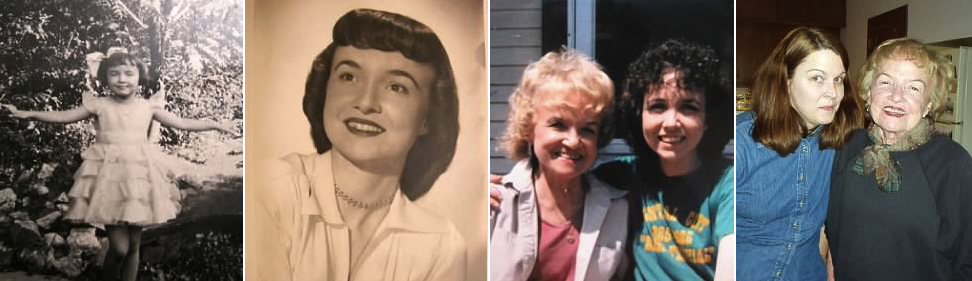

Mom passed away on Sunday after a battle with cancer.
For the last 40 years of her life, she managed the farm featured in this blog (which she and Dad bought together in 1963), in addition to being
 a writer and nurse. Below are Mom's obituary, memories from others, and family photos.

After Mom's death, Jeff and I decided we wanted to keep the farm. Dad really wanted us to keep it, and it was too hard to let go of the memories. So Dad loaned us the money to buy out our sisters.
We knew the farm would give Dad something to do every day, and we could have an adventure with it and with him.

## Obituary

Lois Ann Schank, 87, of Central City, former editor of the [Republican-Nonpareil](http://republican-nonpareil.com/) newspaper and nurse at [Litzenberg Hospital](https://www.bryanhealth.com/locations/hospitals/merrick-medical-center/), died February 24, 2013 after a battle with cancer. She was born in Omaha on February 15, 1926 to Frieda and Arleon Spellman. Her mother's family was from Russia; her father was from Michigan and is interred in Arlington National Cemetery.

Lois was an avid learner, wonderful writer, loving mother, and caring nurse. As a youth, she was accomplished in dance (tap, jazz, ballet), and also liked to play golf and tennis. Her interest in writing began early, as a reporter for her [high school newspaper](http://bhs.stparchive.com/Archive/BHS/BHS05291942p02.php). At the University of Nebraska at Omaha, she majored in journalism and history. She moved to Central City after college to wed Charles Schank on September 6, 1952. Married for 20 years, they had four children together: Jeff Schank, Suzanne Schank, Sandra Schank, and Patricia Schank. Lois worked as a reporter at the Republican-Nonpareil for many years, and became editor of the newspaper in 1974. In 1987, she changed careers, entering nursing school. She worked as a nurse (LPN) at Litzenberg Hospital for 13 years, retiring around age 77. Throughout her life, Lois remained politically active, writing letters to newspapers and government representatives. She attended the Episcopal Church and the Friends Meeting in Central City, and was active in [PEO](http://www.peointernational.org/), the [Democratic party](https://nebraskademocrats.org/) and [Nebraskans for Peace](https://www.nebraskansforpeace.org/).

Lois is survived by her four children, granddaughter Chelsey Cameron (who followed her grandmother's path into nursing), and great-grandson Ethan Cameron. She was preceded in death by her parents. The funeral service was held in Central City on March 2, followed by a luncheon hosted by PEO and the Friends Meeting and held at the Episcopal Church. In accordance with Lois's deep interest in peacemaking, the final musical selection at her service was A [Song of Peace](https://www.youtube.com/watch?v=NTBiRiHnRmM) by Mary Travers. Memorial contributions may be sent to The [National Cancer Institute](https://www.cancer.gov/about-nci/organization/obf).

## See Also

[Memories of Lois, editorials, and family photos](https://www.hamschank.com/memorials/lois/index.html)
