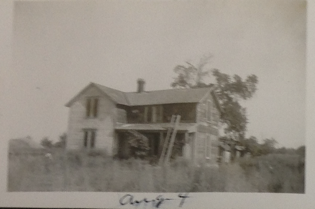
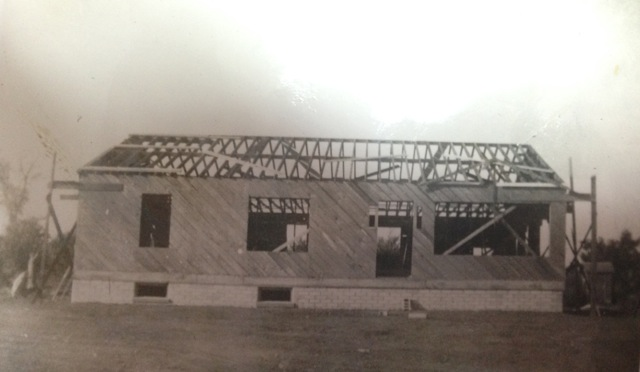
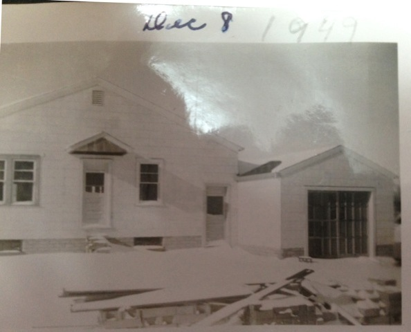
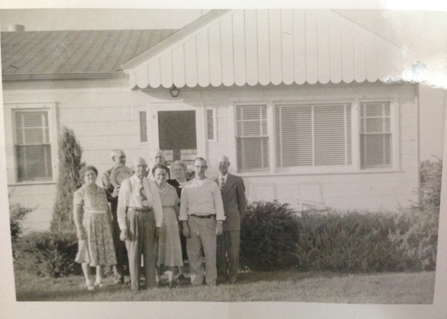
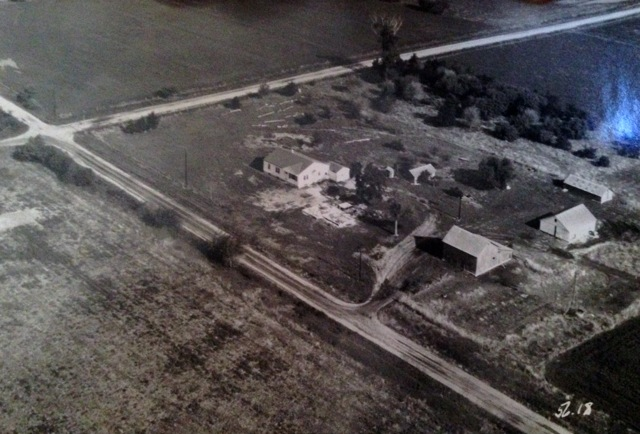

Courtney, who (with her husband) rents our house, shared some photos with me from her mom's photo album from 1949! Small world: Courtney is the great granddaughter of Alfred Kohtz, who Dad bought the house and farm from in the early 1960's. That's why Courtney so wanted to live here, and contacted us when she learned from her uncle Lowell that we planned to rent out the house.**

The history**: Alfred Kohtz had two children, Deloris (Courtney's grandmother) and Lowell, who grew up in the house. Dad was good friends with Lowell, who did some trucking for Dad (they rode to Wyoming together several times to get jack rabbits to feed Dad's mink). Lowell came to Dad's house one evening in the early 1960's and told him that his dad's farm was for sale and he should buy it. Dad bought it the next day. In the later 60s, Dad bought another adjacent farm (Cavendar's), which completed the 176 acre farm we have today.**

Below are some of the photos that Courtney showed me. When Alfred bought the farm back in 1949, there was another house there. They tore it down board by board and built the new (current) house themselves, using some of the wood from the original house.

First, here's the original house** that was on the homestead, **probably built around 1875.** The house was built where the east orchard is now. Nebraska gave out land as part of the Homestead Act, and the first recording of [homestead entries started in 1870](https://history.nebraska.gov/sites/history.nebraska.gov/files/doc/publications/NH1972Homesteading.pdf) in the Grand Island area. No wonder our Swedish ancestors came to Nebraska to homestead in the 1870s & 80s. (Dad's grandpa Johannes and his brothers Johan & Peter had farms just a few miles away.) Scroll down for more.

Courtney had many photos of tearing down, laying the new foundation, and building the new house; below are some highlights.

Alfred built the current house between August and December 1949, after tearing down the old 1875 house. They used some of the wood from the old house to build the current one. Here's a front view of the building:

The east side of the house in December 1949, when Kohtz's are almost done:

And a photo of the Kohtz family in the front of the house, maybe 1950 or later.
I think the young man in the front right is Dad's friend Lowell.

And finally, a photo of the farm probably around 1950, before the current barn was built. The original corn crib is there (far right), and there is a old barn between the corn crib and the road. After building the house, Alfred tore down the old barn and built the current barn behind the house. Note that the current house is a little bigger now; w
hen Dad bought it the early 60s, he and mom added on two more rooms to the west.

The old, original driveway was converted to lawn sometime in the 60s, but is in the same location where we put in a second driveway just last year, using dirt from the shelter belt area where we pulled out the trees.

