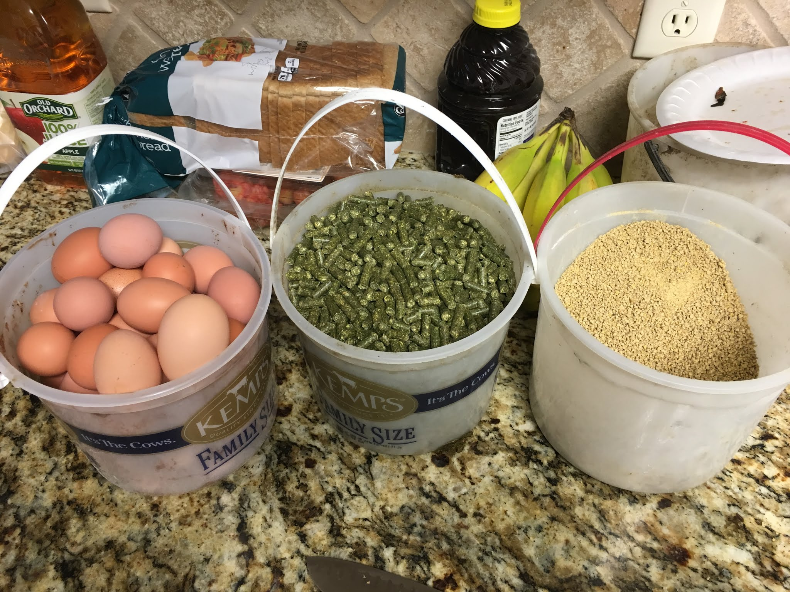
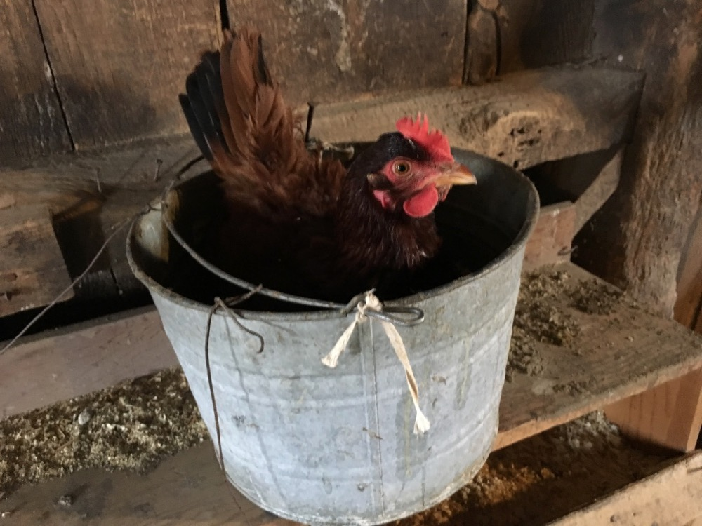
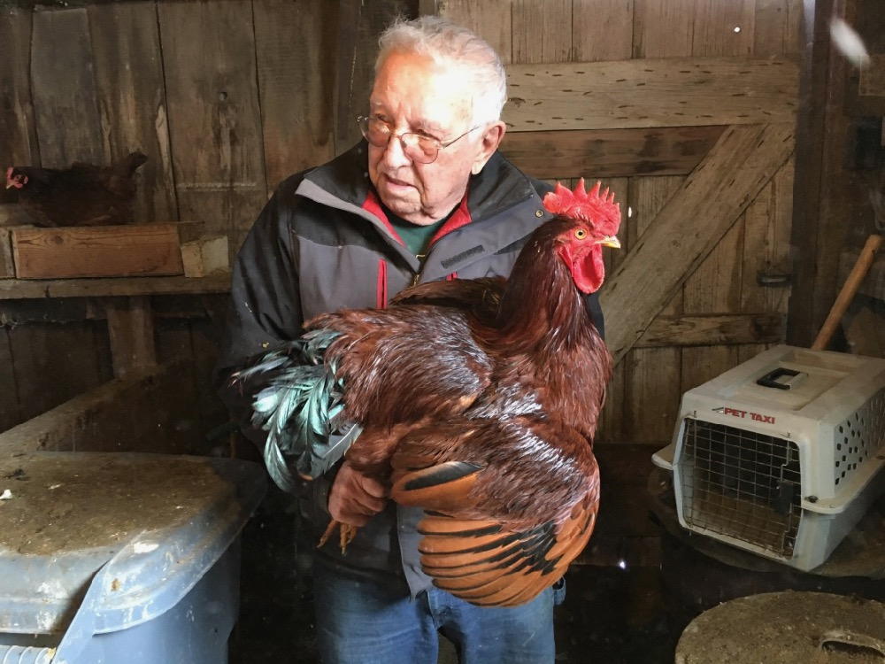
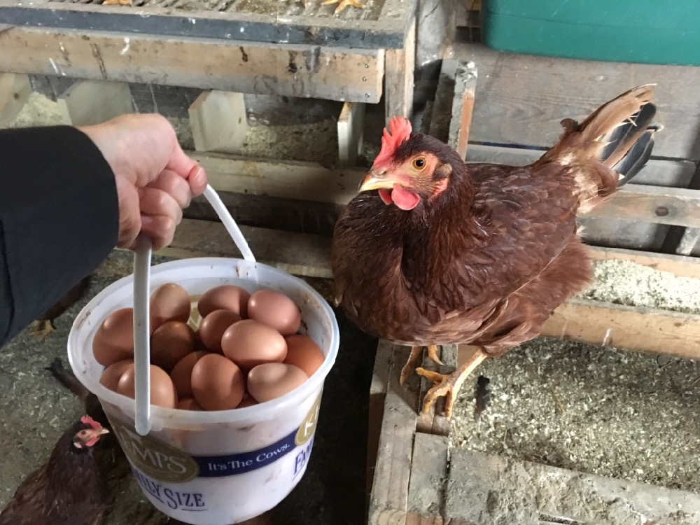

Keith

shares some of his plans for crops next year:

"I talked to the neighbors on the east side of the farm it sounds like they are not planting enogen corn around there. This is good news because that opens up the possibility that I may be able to grow white corn there! So I'm really excited about this possibility.

For the west side I still plan on planting soybeans.  My seed dealer did bring to my attention though that there is a high oil food grade soybean that I could plant for next year.  They are called [plenish](http://www.plenish.com/) soybeans and they get marketed direct to a soybean crushing plant such as [Agp](https://www.agp.com/business/business-soybean-processing) in Hastings. We already haul our soybeans to end users so it wouldn't change anything with the way dad and I market them... I'd really love to hear what you think about them."

I'm excited about the no-enogen on the east so Keith can plant white corn! Enogen is a GMO that is engineered to turn into a slurry more quickly, which makes processing into ethanol faster. But if you cross-pollinate with regular corn or get enogen kernels in your corn, that's no good if you want to sell it for human consumption. Turning into a slurry doesn't make for good corn chips. If you try to sell white corn for food and they find a kernal of enogen corn in a truckload, you're turned away.

I'm not a fan of farmers growing enogen. You can get a 50 cent premium per bushel, but you have to store it in your own bins (there isn't enough storage at the enogen plant), there are fewer places you can take it to sell, and it's not clear that you get as good a yield.  And it can mess up your neighbors plans if you grow it! (We can't grow white corn if our neighbors grow enogen corn.) And if
 you grow enogen, you can't grow corn for human consumption the same land the next year - and you have to clean out your combine before you pick other corn, and your bins so they're squeaky clean if you want to store other corn there next year. Our farmers told us that it's not hard to lose that 50 cent premium to storage and transport costs, and lower yield - and then there's all the cleaning labor you have to add in.

Anyway, as long as you've read this far, here are some photos of Dad's chickens and feed :)

