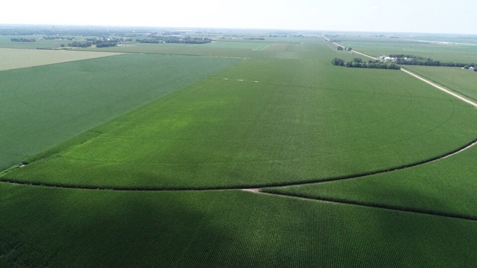

Keith sent some pictures, and says "The corn around here looked pretty rough last week due to the cold weather and lack of sun shine, but the weather has turned around and the corn has its green color back.  I was fertilizing it yesterday and took some more pictures so I have lots of pictures to share!"

