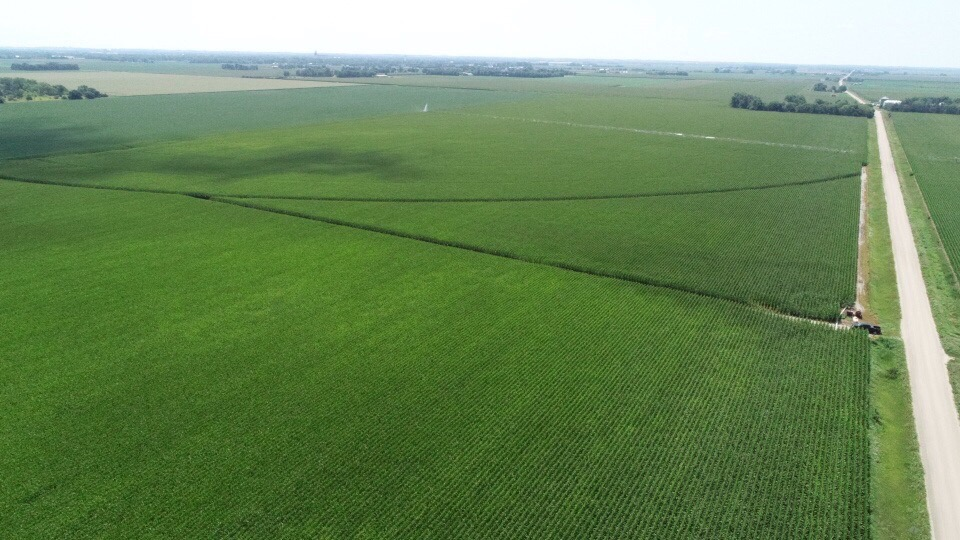

Keith says, "

Everything is looking great so far.  I got the nitrogen on yesterday, just in time too.  It was just starting to get a yellow look to it.  All the rain and wet weather has been hard on a lot of crops around here.   The beans look pretty good too but I can tell I had a little herbicide damage on them.  I need to spray them again but need to put something in to kill the corn that's coming up from losses last year and dad won't let me put it in until we are done spraying the corn.  I hope you'll be able to come see harvest again this fall.  Since you won't be able to see the crops for awhile I will continue to take pictures and share them with you."

