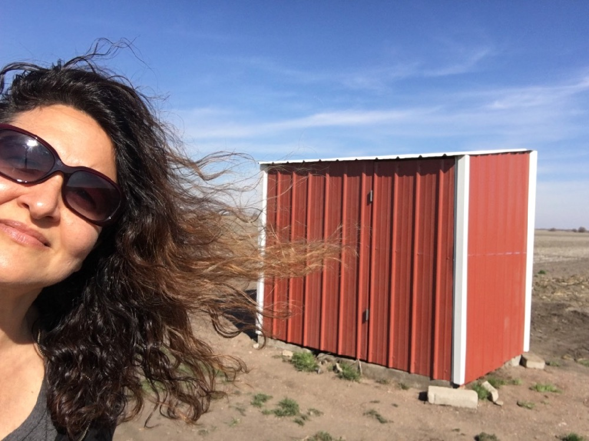
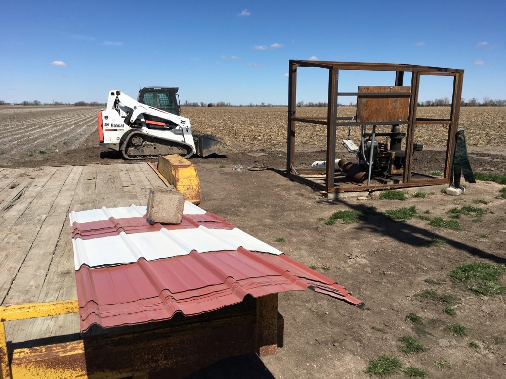

Keith ordered some iron, and he and his dad built a replacement shed for the south well. Before building, we talked about colors and decided red with white trim would be cute. (Red *is* the Swedish way.) They did an awesome job! Dad says it's the best looking pump house in the county.

The building process:

