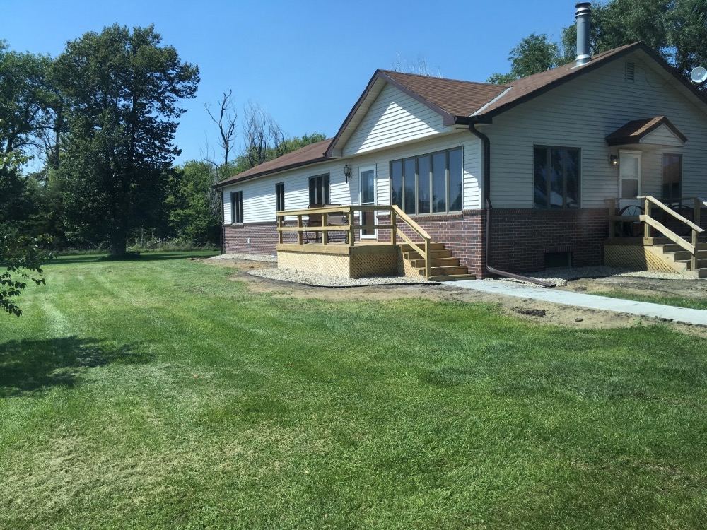
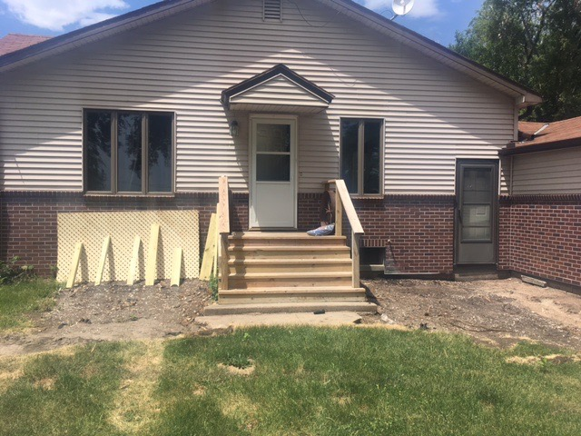
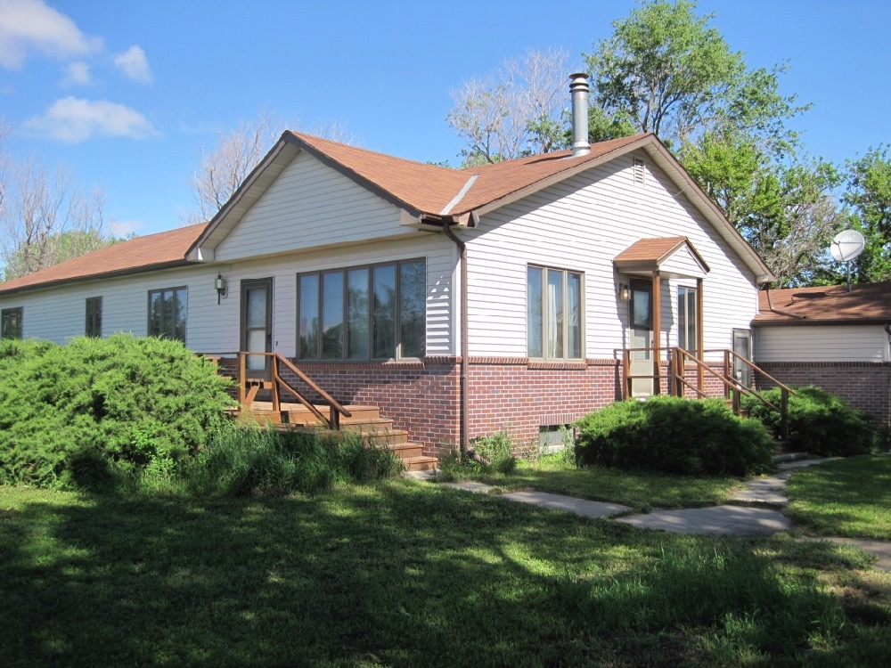

We pulled out the old overgrown bushes, added dirt and rock around the house, upgraded the sprinkler irrigation system, pulled out the old broken cement porches and sidewalks, poured new sidewalks and built new wood porches, put on new doors, and (after this photo), put on a new roof. Whew! See also [photos of the original homestead in 1875 and this house when it was built in 1949](https://schankfarm.blogspot.com/2015/03/the-farm-and-house-in-1949.html).

Here's how it looked in 2013 with the 50+ year old evergreens that Jeff remembers trimming when he was a kid. We liked them, but they were overgrown and we needed to make the foundation more water tight, so we decided to remove them and the broken cement porches (which were funneling water toward the basement), add dirt around the house so the ground sloped away, rocks to improve draining, and only small bushes in future landscaping.

