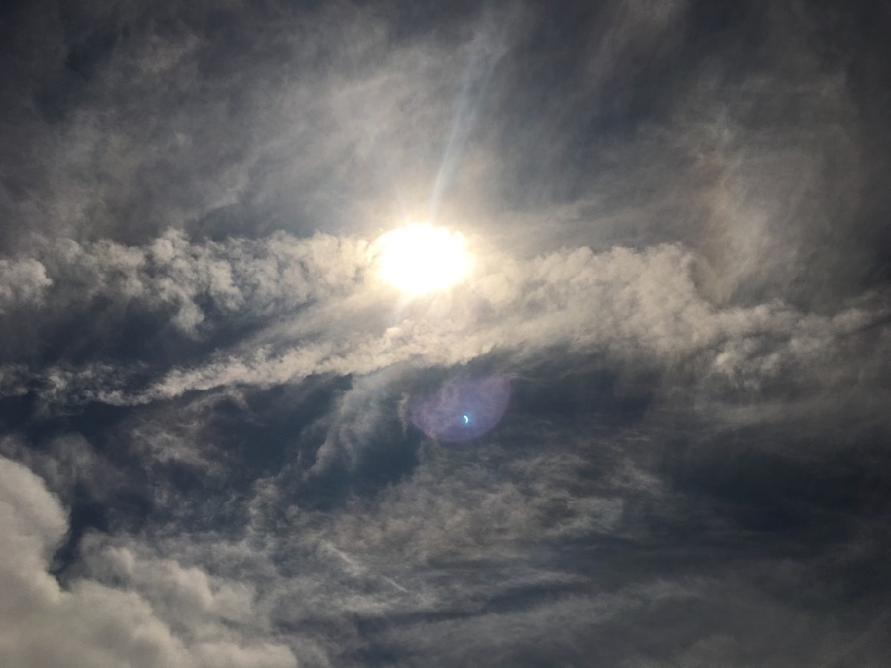
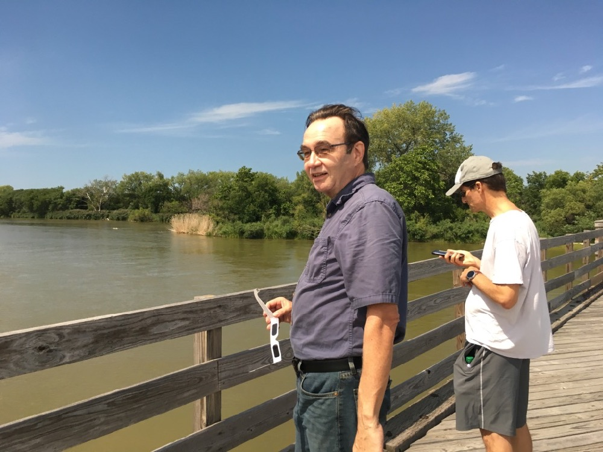
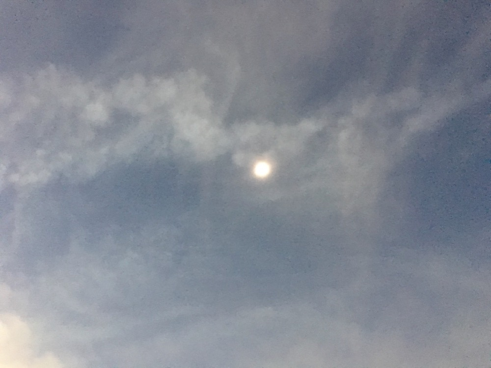
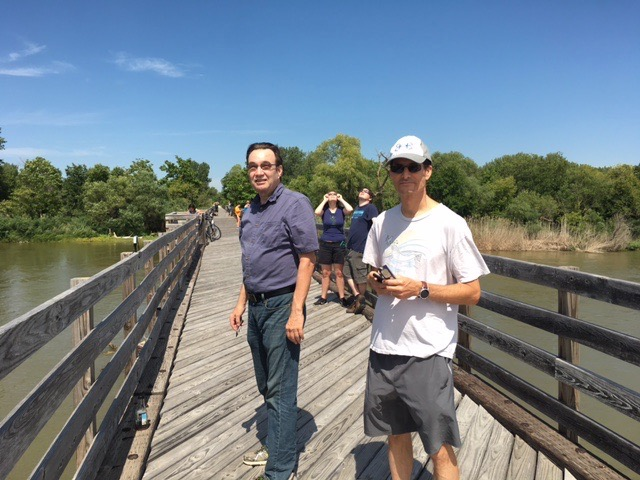
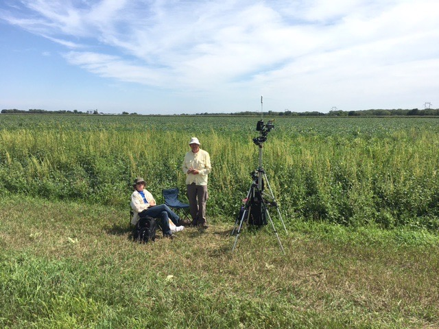

Woo hooo, the August 21, 2017 total eclipse went right through our town. We walked from Dad's house to the Platte River bridge on Dark Island Trail to experience totality. OMG IT WAS AMAZING.

Here is a [playlist on Youtube that shows us experiencing totality](https://www.youtube.com/watch?v=GnrM4NXrzYU&list=PLwOg8z7KeiqZdMfXQWLKZEEmcAnBfE7OR).

We enjoyed talking with some professional photographers along the trail; they came from Michigan to this spot to get time-lapse photos. They graciously gave me two digital photos a week later, and let us share them with others in the community. The photos are hanging on our walls, but I can't post them here because of the license. Come by sometime, and I'll show them to you!

