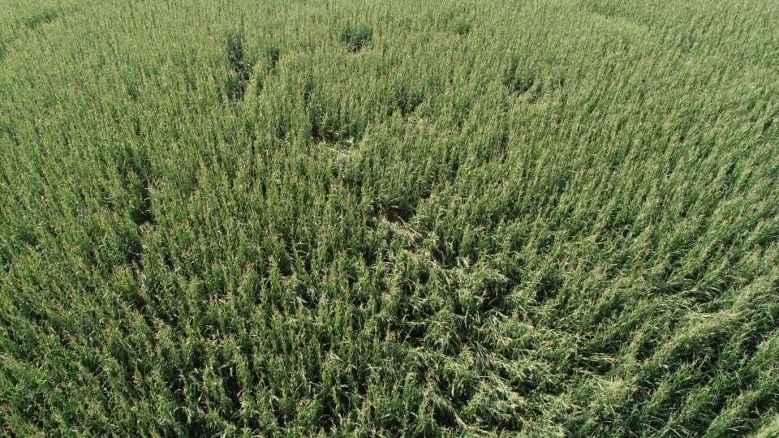
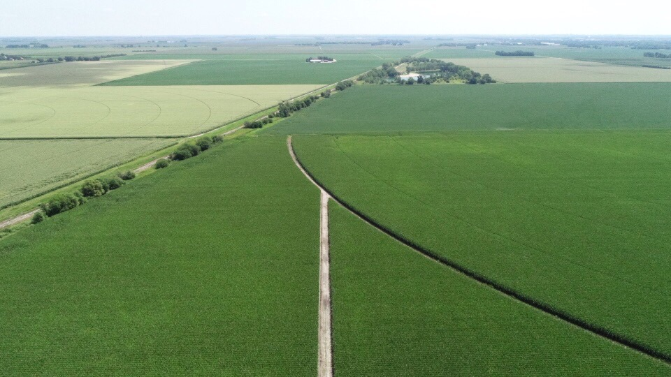
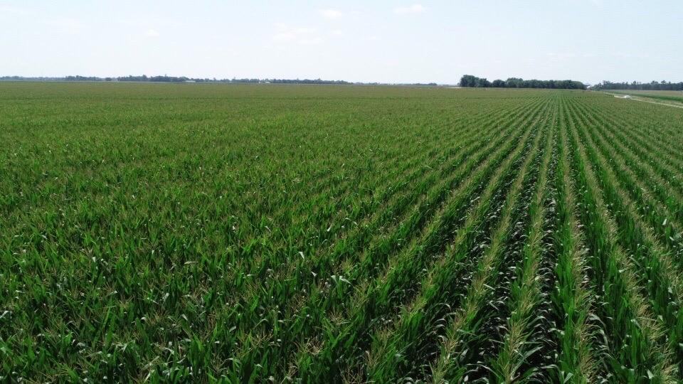

Keith got a drone! He says,

"We got the end gun fixed this afternoon.  I'm still waiting on the pivot dealer to come fix the leak in the middle but it will run how it is for now.  In other news your dad and I took some pictures earlier today. I'm

sure you will like them!

The drone is a new toy but I'm going to use it mainly for farming

. It gives you a whole new perspective of a field when you can see the growing crop from a birds eye view.  I wanted one last year to help me pick

out how much of a disease I had in a bean field but it was hard to tell from the ground.  I decided not to buy one at the time but then we had corn break off this year and it's been hard to tell how bad it is walking

 out in the field.  So we decided to buy one so we could tell how bad it is."

The first three photos shows most of the farm (from the north, looking south) -- currently, soybeans on the left, corn on the right, and the farmhouse in the distance on the right (first set of trees in top right).

Here's a [video of the drone taking off](https://www.youtube.com/watch?v=3chDhrWVd3Y)(though this is a year later, in August 2019).

North end looking south:

North end looking east:

