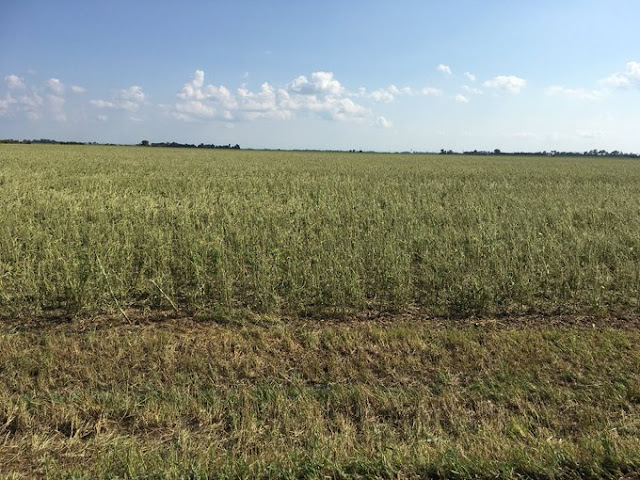
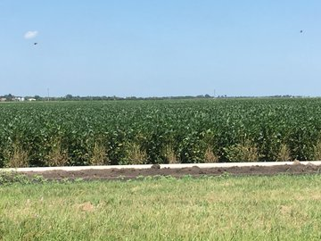
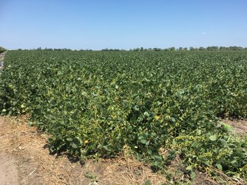
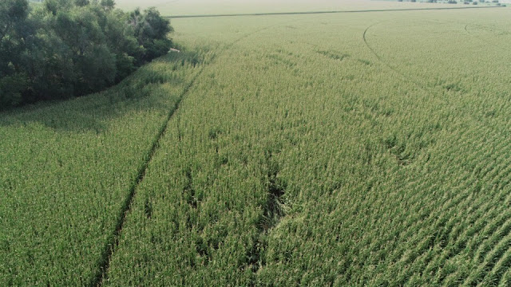
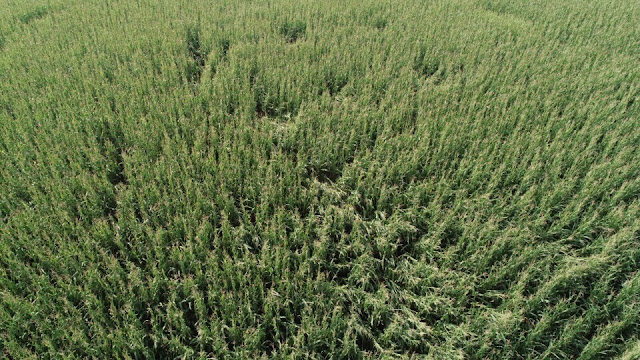
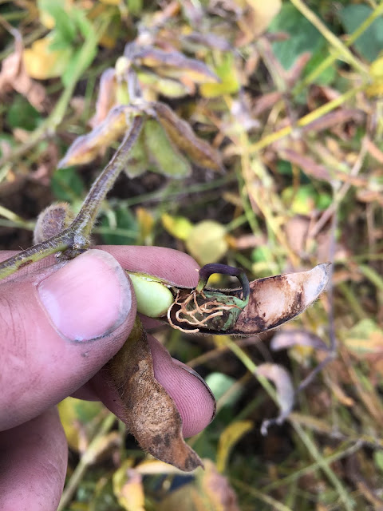

A hail and wind storm hit on August 6, the night before I arrived. The main path of the storm traveled from the northwest to the southeast, completely totaling farms in it's path. About 1.5 miles west of our farm, fields were totaled (top). One mile east of us, there was no damage (middle, how beans should look). Ours (bottom) were tangled by wind, and a few leaves stripped. Estimate is about 20% loss. The same thing happened 4 yrs ago. Are we bordering a new hail alley?

Soybeans 1.5 west of our farm were totaled:

One mile east of us, how soybeans should look:

Keiths beautiful soybeans, tangled and some leaves stripped:

And some photos (later) of the farm from the air. Insurance assessed the corn as 40% damaged and the soybeans at 80% damaged (!). Keith's gorgeous beans would have totally yielded > 100 bushels/acre if this hadn't happened. The county average is 40 bu/acre.

