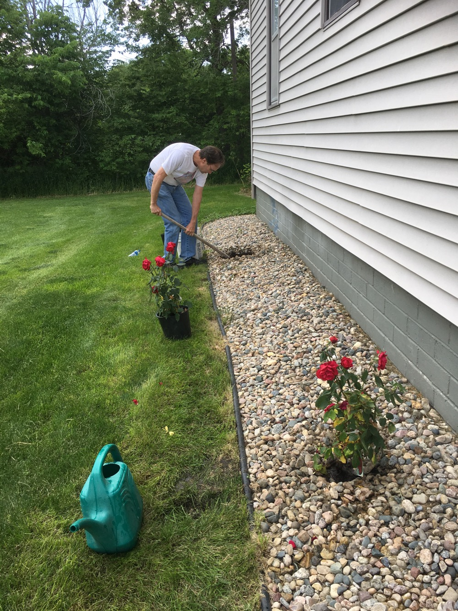
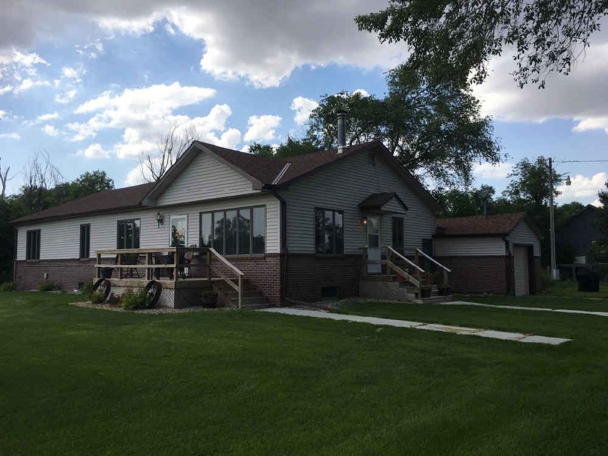

The house and lawn have [come a long way in the past two years](https://schankfarm.blogspot.com/2017/08/major-farmhouse-updates.html). Dad and my brother Jeff have fertilized the lawn regularly, and I planted small bushes including Goldflame Spirea around the house. Dad and Jeff also planted a little orchard of fruit trees (apple, cherry, peach) in the north and east lawns.

Today, Jeff and I are having fun doing yard work together, including planting roses that Dad picked out. We're both visiting from California to help Dad as he recovers from a health issue. Still, that doesn't' keep him from telling us what to do from the pickup :)

