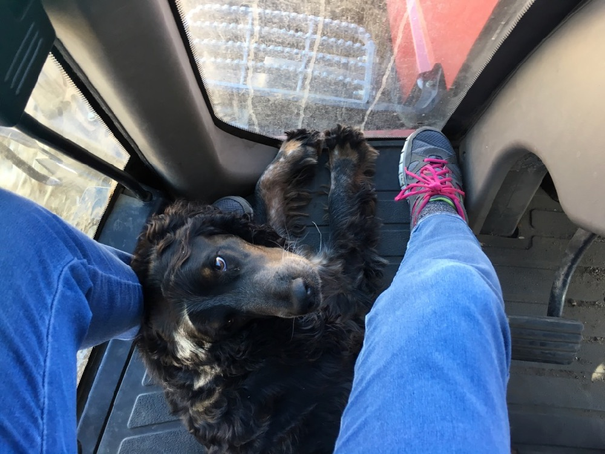
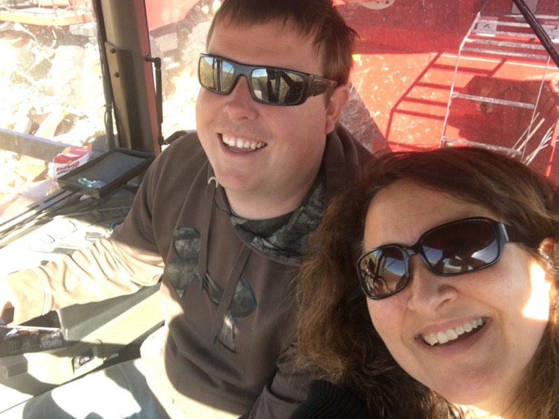
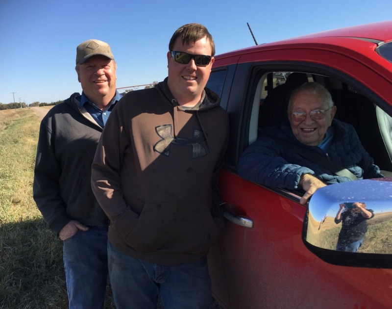

It's harvest time!
 I rode in the grain cart with Keith and Dad rode with Keith's dad Larry as they picked the last of the white corn on October 26. The monitoring screens in the combine showed instantaneous yields from 240-272 bu/acre, so they probably averaged more than 250, which is fantastic. Their machinery is quite

 automated, though you can still control a lot, like the speed of things. As a neighbor (Kevin) noted, with automated steering you can look around and watch everything instead of having your eyes glued ahead to make sure you don't wander out of the row. It makes harvest much more enjoyable!

I asked Keith if/when he thought harvest might be done all by machine. "The technology is kinda there already," he said. Kinze developed an [automated grain cart](https://www.youtube.com/watch?v=sqlHtH0Np7c) awhile back. "In some ways I don't know if I want that, because I like running it. Takes away my job! Dad would fire me. At the same time, we had trouble finding help [for the harvest]. But the jobs that get automated would be the ones I like to do the most. You'd still have to go work on all the stuff [machinery], but I don't like that job as much. This is the rewarding part." Yup. Companies sometimes automate away the good stuff and even [downgrade human experience](https://humanetech.com/) -- one reason we need more [diversity in computing](https://circlcenter.org/broadening-participation-cs-engineering/) to widen perspectives and help anticipate and manage the negative impacts of technology. But I digress.

Watch the video below to learn more and watch the harvest! (Best to expand to full screen :)

And in case you ever wondered what a field of harvest-ready white corn sounds like...

Oh, and check out this adorable girl (Maiya), who loves harvest as much as we do!

