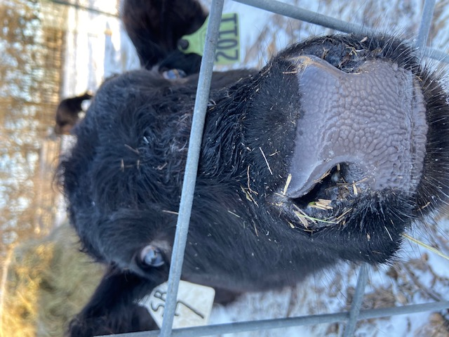
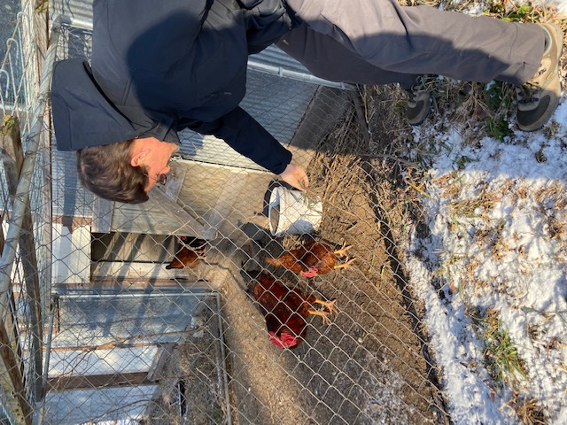
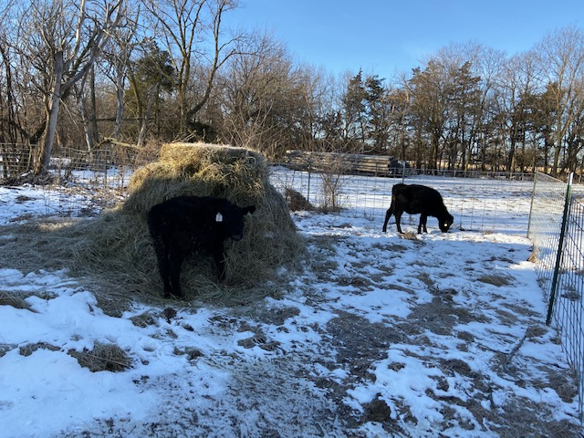

Why can't you stay up until the cows come home? Because it's pasture bedtime!

That's udderly ridiculous; of course you can stay up. But we went to bed early because Dad gets us up at the crack of dawn to feed the chickens. This time we also got to feed grass to two baby calves! Our house tenants are raising them in the barn with plans to show them at 4-H in the fall. How cute are they?

Larry came back with me this trip, and got a kick out of feeding the livestock. Don't worry; we're vegan, and would never eat you or your friends, you cuties!

