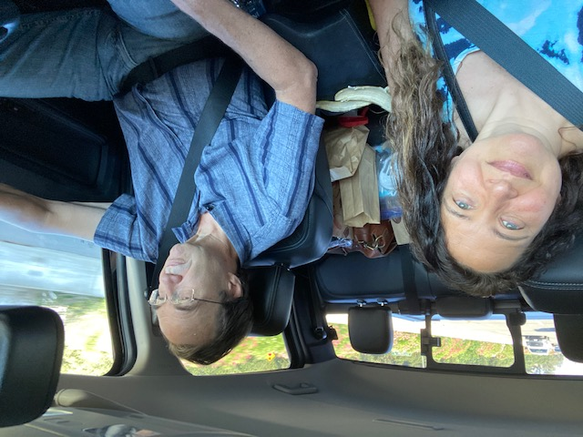
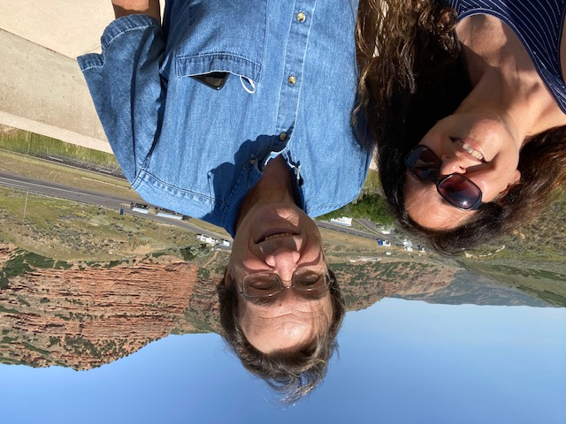
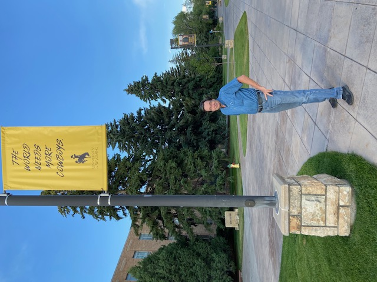
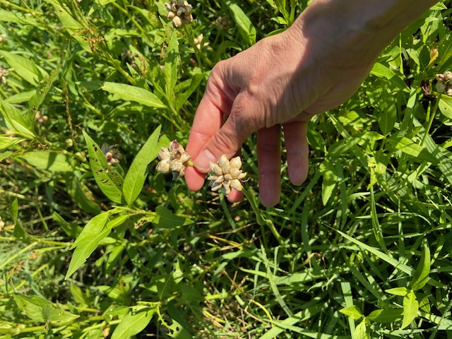
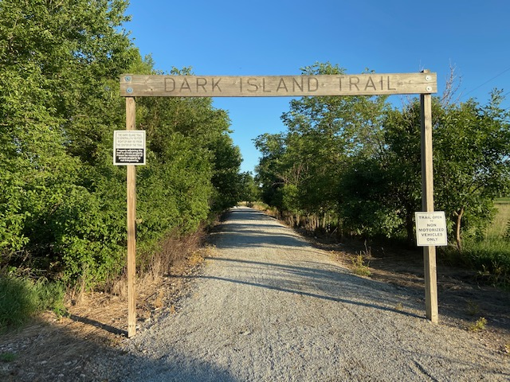
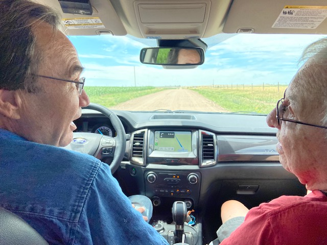
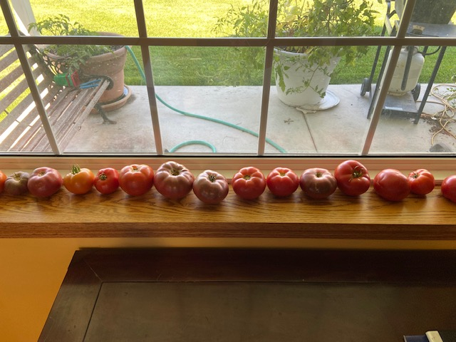
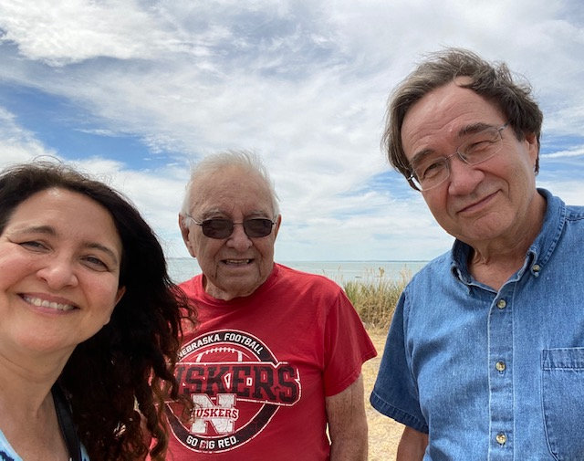
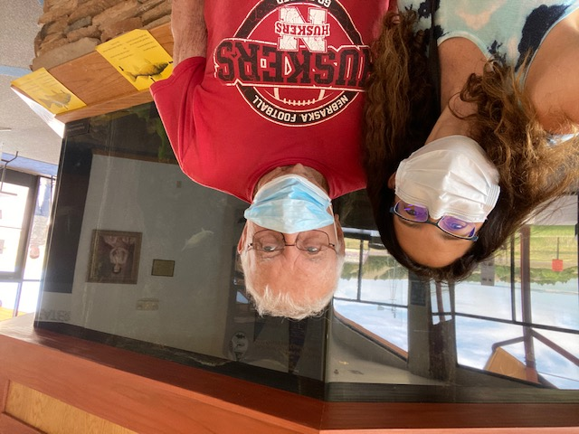

[Jeff](https://biology.ucdavis.edu/people/jeff-schank) and I decided to take a drive out to the farm.

Along the way, we saw some beautiful red rocks.

And a pretty college campus.

And about 55 hours later, we stopped to pick up Dad.

Susie came by to greet us. We strolled on the Dark Island Trail, enjoying baby bunnies and handsome horses along the way.

Then Dad and Jeff and I jumped into Dad's pickup and went the last 3 miles to the farm. The lawn looked great!

And so did the corn. It was at least 7 feet high!

In the road ditches near the house, we picked some wild onion...

to take home and plant.

But after 1600 miles, we needed to stretch our legs. So we headed out on the trail again.

This time toward the river, along a quite popular route...

until we reached the old railroad bridge across the Platte.

To watch a beautiful sunset.

And enjoy flickering fireflies and the smell of a Nebraska evening.

Goodnight, little toad on the trail!

After a good sleep, we decided to meander more and see what we could find.

First, of course, we gave the chickens some breakfast of fresh-cut grass and chopped tomatoes.

And Courtney introduced us to 10-day-old calves, Brownie & Blacky, who she rescued and was raising in our barn!

As usual, Dad also put us to work. We tied stakes to two young trees and fertilized the lawn.

And then meandered some more, to a nearby buffalo ranch.

Back home, we made sandwiches with Dad's tomatoes.

Which he waters well every day.

And caught up with Cliff and Kathy, who biked by to say "hey!"

The next day, we meandered 4 hours away, to Lake McConaughy.

 It was pretty.

And packed! Everyone wants to be outdoors.

Luckily, the visitors center required masks, so we felt safe inside when nature called.

Back home, Susie came by to visit again. We headed back out to the river bridge.

And caught a beautiful smile.

And striking colors on the way!

Outdoors is a great place to be. Don't you agree?

