[Jeff](https://biology.ucdavis.edu/people/jeff-schank) and I decided to take a drive out to the farm.

Along the way, we saw some beautiful red rocks.

And a pretty college campus.

And about 55 hours later, we stopped to pick up Dad.

[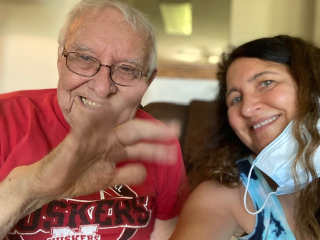](https://blogger.googleusercontent.com/img/b/R29vZ2xl/AVvXsEhzDmuZKXdcX5_krVRPvxPxlwZ4ByNwDPlY_tpLJ84qIHoMUc1Z2qM9mpCebvC59W_m_lk_pZzH2L8m9E-0fSsNu8Jq8wWWR0y757IAxj9kYkkbpFxWD_m5XCMi9OlCAevTzm11Y1UOeq3x/s640/IMG_6080.JPG)

Susie came by to greet us. We strolled on the Dark Island Trail, enjoying baby bunnies and handsome horses along the way.

[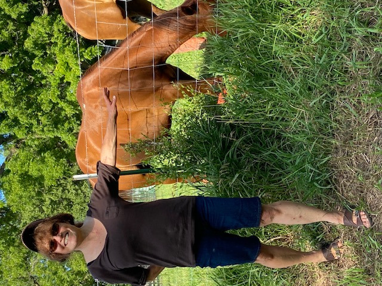](https://blogger.googleusercontent.com/img/b/R29vZ2xl/AVvXsEiw4qmBcgNCoOOQcSiVeoK-AhhoxVG5DobPkaJV4UcN_PP3n3ot-YsuX6VQzn5GiIQxlLYE0A0-JX-gzbcImn0txjod1lTyyjMT4y12_bgrUjjkcEEFpCngaa8GZmapz20xfm_q7cljoKwP/s640/susie.jpg)

Then Dad and Jeff and I jumped into Dad's pickup and went the last 3 miles to the farm. The lawn looked great!

[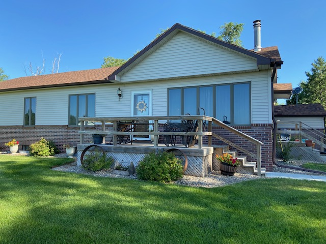](https://blogger.googleusercontent.com/img/b/R29vZ2xl/AVvXsEjH4UPf9HeXPfvcRHHjdISsxJWclfA8MAYEzs6C5EQEl-mSrz-UKlrmlCnVJRCGeT03syhW0g6yN8CoVH4BqRMAfH0jeB88xq69I9FYC_3yIt0q-dFPc4T6eamSPs90U78PEhpDdBOEcP_j/s640/IMG_6145.JPG)

And so did the corn. It was at least 7 feet high!

[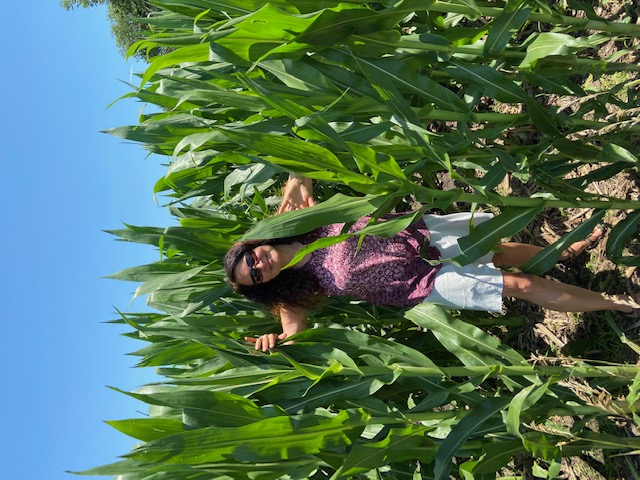](https://blogger.googleusercontent.com/img/b/R29vZ2xl/AVvXsEiHF1CZw_3gTA6uDKoASyQXT867CGpROAiuhgg4C0S6YnW3CQfBTWmZN4TcUFJXIfsxD4dMn1Q1jCwr0PJl4EkLyr3hdIgwA1xi8gg4eNG7pnUE1UF-Ah03Zb0GKq-rL7UN0j-UV5HI9Mor/s640/IMG_6181.JPG)

In the road ditches near the house, we picked some wild onion...

[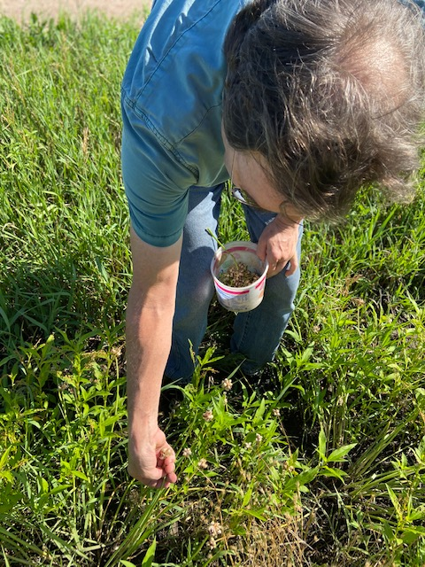](https://blogger.googleusercontent.com/img/b/R29vZ2xl/AVvXsEhuvj6SEZ9fHPX9MO-W1dysSK0cuEe7fxc7ZQregqYGZrMuMGRutTGSZbioI-uTDA1TvmJF3k9KUIOu_c0yo-igoEfaMG6mxbXcURBoqTfDHIikde9LVphuxYMtNR80lzR9f1a-EldlnEcT/s640/IMG_6166.JPG)

to take home and plant.

But after 1600 miles, we needed to stretch our legs. So we headed out on the trail again.

This time toward the river, along a quite popular route...

[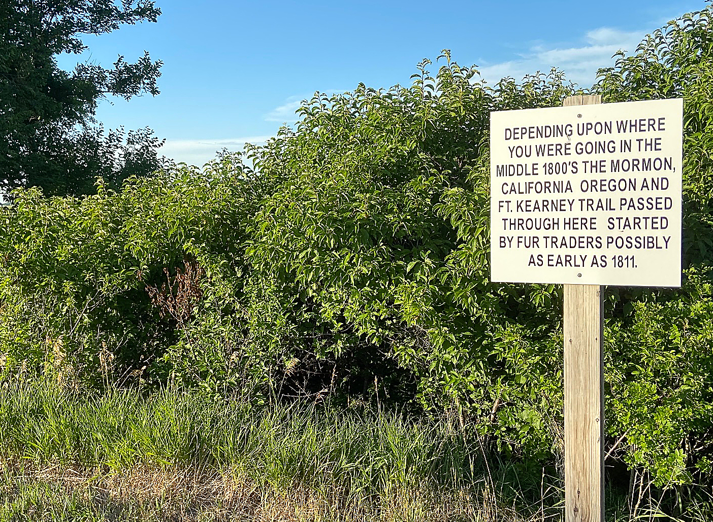](https://blogger.googleusercontent.com/img/b/R29vZ2xl/AVvXsEgF3zl6zoi8j2DPkW05fbDc-hDoZs5J4EZ84dokOSNvminrzc5HEOzVq8TDzfN-WgyFF6_5Wf5i6tE5vD_2nBgtky26PlZtyTupBwNA8KgnQ0mh7MQv9DArLKiN6mVdyz2PvALqOsaoWHIf/s1404/sign-sharper.jpg)

until we reached the old railroad bridge across the Platte.

[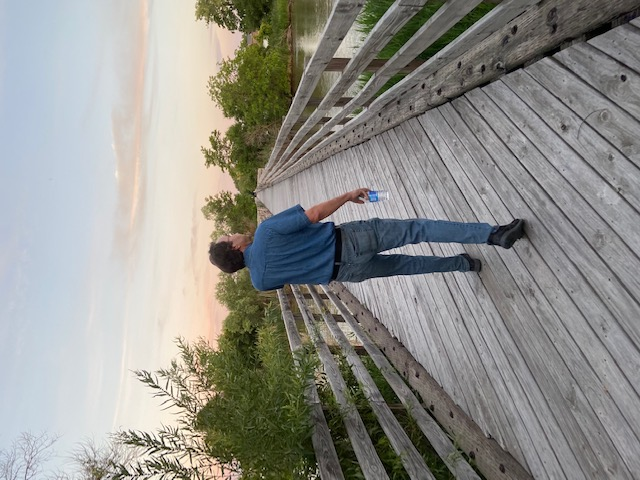](https://blogger.googleusercontent.com/img/b/R29vZ2xl/AVvXsEi8nL767xCYVzWTdBQAKkmEI5ixVcQ2s9ZJII0SlDZSQt6vfh6bOCruqcZn4ldwFmOwM98R5ZRtB3MSRgMfWmzp5UQ8WvSmT7BwRgp2i0eXRH0z4hNYGJIc0edMWZKOAjoxV89dG-fAMb0x/s640/IMG_6219.JPG)

To watch a beautiful sunset.

[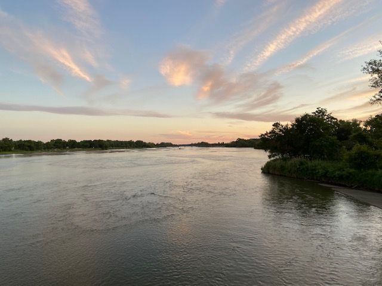](https://blogger.googleusercontent.com/img/b/R29vZ2xl/AVvXsEjwtmwOiMWAKZWH-yR3P1D79BMWW86LvnUKA3o2yjcV_T66X3x4wZmwe3otVWMAzBFlEL5bpoXYk67Ft9B_d3XPewUWrqk1taS8vs2QLfSpo5Na8-Ci_kCyztNHbjnf18LHb7JrUbRez4cj/s640/river.JPG)

And enjoy flickering fireflies and the smell of a Nebraska evening.

[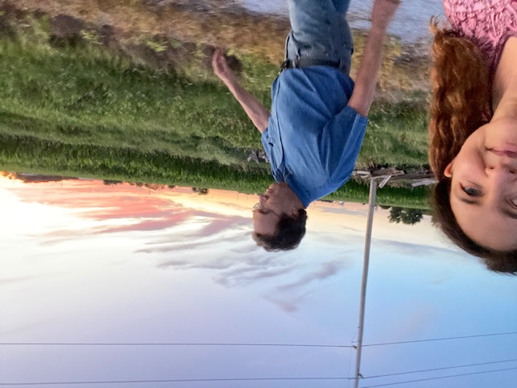](https://blogger.googleusercontent.com/img/b/R29vZ2xl/AVvXsEjXbxXOXavH8GJOYLAOa0F3_39-VM9IROjudVx7FiqFbXEVHMN2jeok7DbzoGnqiT7roG698wfIV_ilTezScoyn4cxpRvXo97W1mIzcj0ygnKw5NFVCOcnNMovgPger14CG1UQ-2Ailohos/s640/walking-uss.JPG)

Goodnight, little toad on the trail!

[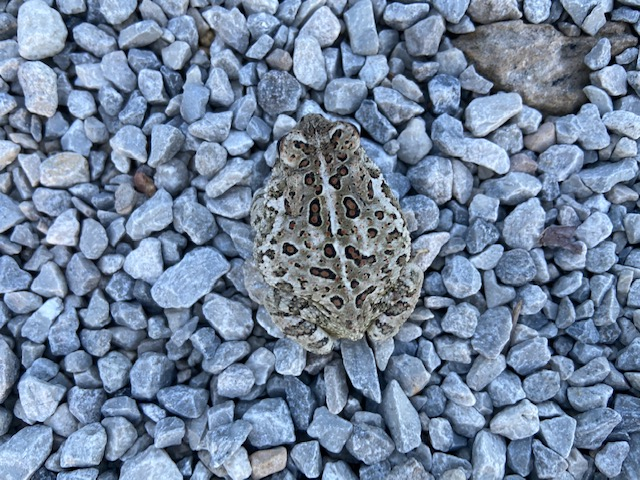](https://blogger.googleusercontent.com/img/b/R29vZ2xl/AVvXsEiydHdHP4l15yb2zZY_06IYvhHKNqEeHmysSPECwgHNcw-I1H6O4O7QTysR4NvVJRaJnJK5faCz2yqucVIv7itMyzbUWd_Z-9FEWJJbNGO0rYCrQEsw46hOe9lpX3BCYyRnDn1bh-3sNGBu/s640/toad.JPG)

After a good sleep, we decided to meander more and see what we could find.

First, of course, we gave the chickens some breakfast of fresh-cut grass and chopped tomatoes.

[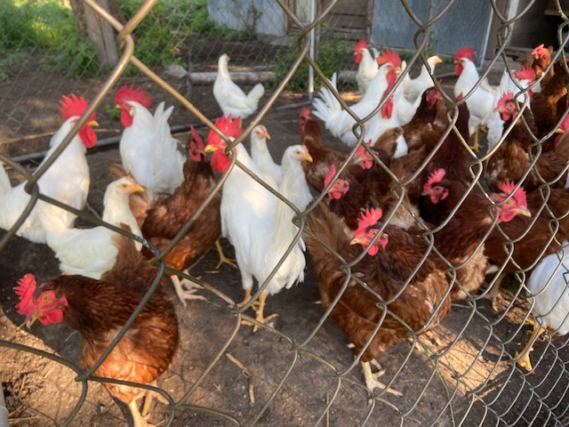](https://blogger.googleusercontent.com/img/b/R29vZ2xl/AVvXsEhclmqjEvohOHPcqxizqqo3R3OfM4hK4mHRm8HHkReigUwMVmTAaWKm0RU-xsMJPKsXkm6AYIYerslbk5lOwKWJvg888qsMVNDCisRMv3EasDPwN0IzNtfDM7aLTXQSbIFo0k3nuB88MxsU/s640/chickens.JPG)

And Courtney introduced us to 10-day-old calves, Brownie & Blacky, who she rescued and was raising in our barn!

[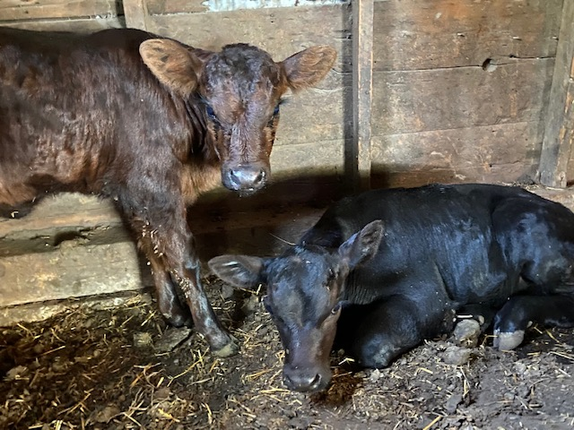](https://blogger.googleusercontent.com/img/b/R29vZ2xl/AVvXsEhB05UAUmzNixuHQEM1ugLly_NlqXLKCjvI1p4XXYo7Z76VL1nnzrS4MbNl6hG6OIv6vOwF3AwQYE2q5kB5Kvdew-A3XgrLOKDcGvx3Jco97sT_i0MinAVfjQq_OZnsqVY7fEI010sdC84J/s640/calves2.JPG)

As usual, Dad also put us to work. We tied stakes to two young trees and fertilized the lawn.

[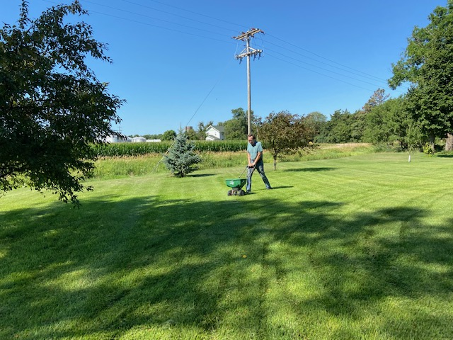](https://blogger.googleusercontent.com/img/b/R29vZ2xl/AVvXsEj7Ual1raIP-kTyJX3LyjTfy7Tjbf17zGtVT0rirHULaUvA30u2S4ZLEgEAJNw-GJ2bBi1elGr9Q7VB_pyfxFx8xILH1K5TkLNIvv1gHGEYdgt1-5XPFonOmbOyCgpYVy2hAVsw7DffUIK9/s640/fertilizing-jeff.JPG)

And then meandered some more, to a nearby buffalo ranch.

[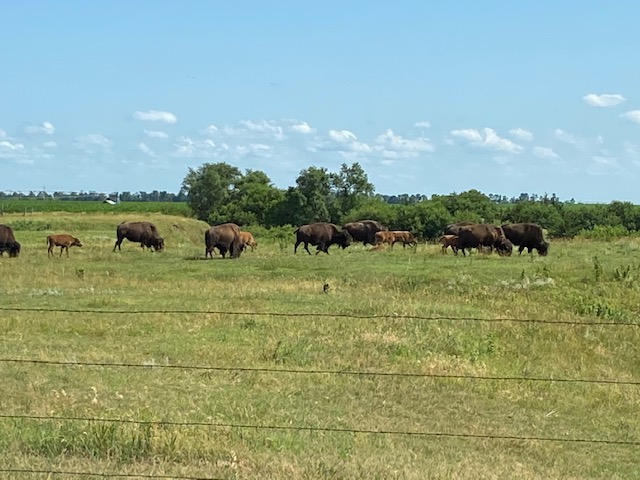](https://blogger.googleusercontent.com/img/b/R29vZ2xl/AVvXsEha-sZGlEYO_4B0W0UJGb_1BEn7biqL6Zg6Y6KACZs_2zFsBnl3iYT-pUzdXvCEyfrpERIv-Pcd4FnL2pqYMvBrQRKDabZ1PIAfsBcsBk0nuhq8TCR3NWRRku6O9-RmRxeacR96JIX_aH-Z/s640/IMG_6182.JPG)

Back home, we made sandwiches with Dad's tomatoes.

Which he waters well every day.

[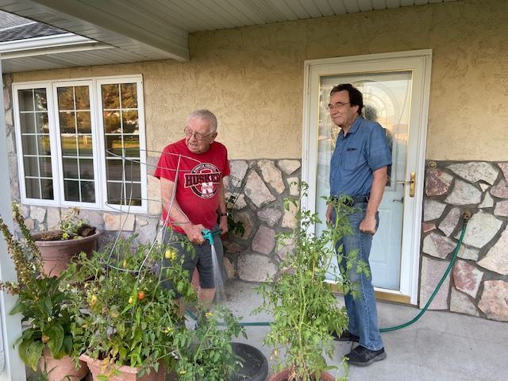](https://blogger.googleusercontent.com/img/b/R29vZ2xl/AVvXsEioshWSIqiT3j44BHXtNcvhV41IQVLQ5niLcUomGU1tcZFK9Dnv4ICl_-9Ez-ZPAroehbZp44x8UPEKt5pHYoiF_HlfdNOZkkpE3kZPhEHmHzdF1PetguAimsp0eiPqHGe9NFzrQxZbHvKn/s640/dad-jeff-tomatos.JPG)

And caught up with Cliff and Kathy, who biked by to say "hey!"

[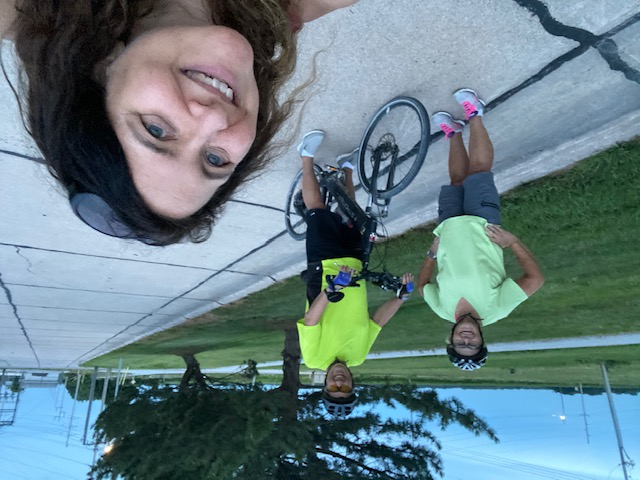](https://blogger.googleusercontent.com/img/b/R29vZ2xl/AVvXsEheBBbw-Y6tRnRCQKgMyiQObKRlX0ZZhsGRY4eMHBpDsCz-kis0FwF11E2MdLVJ7nICN-YuQI9lpkO0suucuFWhmZIw5yFTKBjDpLUJajqxcynvVxVr30Q0YkDPE-EY4IqAxEDjh7CFA84o/s640/cliff.JPG)

The next day, we meandered 4 hours away, to Lake McConaughy.

 It was pretty.

[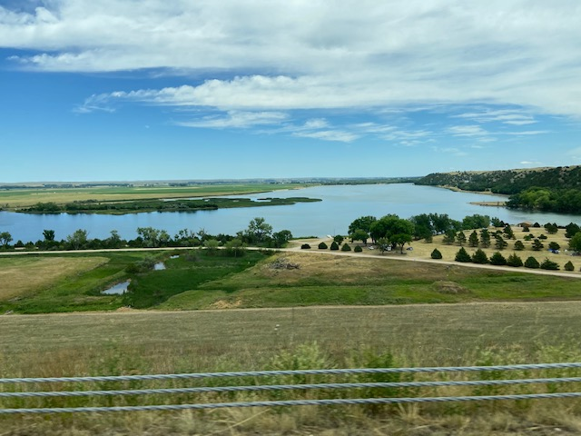](https://blogger.googleusercontent.com/img/b/R29vZ2xl/AVvXsEgz8znahrTECqVhV_ln9BU5Jt6VyKXkH7M9uEHzyjWaOtGGukehhFyM9MJKisIv8cSrt7utkYTU6mp_iaTkd2MLpd8P_6QSD5LV72mmFhUa5Dfzr6b4ve9YCql-iC-3fxP1jGin9w95gAaG/s640/IMG_6198.JPG)

And packed! Everyone wants to be outdoors.

[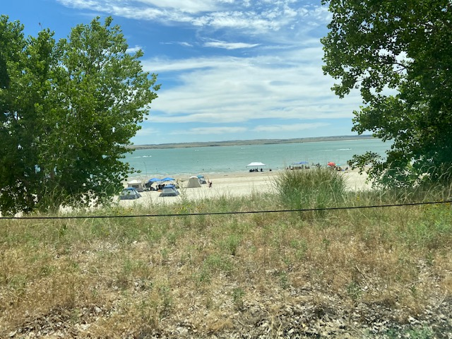](https://blogger.googleusercontent.com/img/b/R29vZ2xl/AVvXsEg3nA_WjZvtbfyY3xmx0c6ScUIhnj92JB7Lll3441vLwMdpeCdg6EPSrVjbhDlOiVHlHbLwC_BtxkDb-tfvLKmLO7Rocrr3tcbnNFa3vLN0Q8NHDRSF8Yh5SQT7QKDWYCNZ7w9kxkySV00J/s640/IMG_6203.JPG)

Luckily, the visitors center required masks, so we felt safe inside when nature called.

Back home, Susie came by to visit again. We headed back out to the river bridge.

[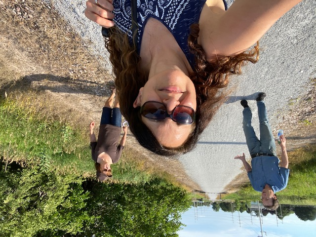](https://blogger.googleusercontent.com/img/b/R29vZ2xl/AVvXsEjrSQOQmdc4oWISdjSSAh9o_ZxkUm3WkUphLr8UrV733e1iWA_qJpRhisaQvcTXXpbukCkyYzm7u-s-EZSjVzpXNIDSt6DNk_HYTJUwLSKogUyWUgY_KISmhurefbK-uXcfPYeoii4hoauj/s640/walking-pjs.JPG)

And caught a beautiful smile.

[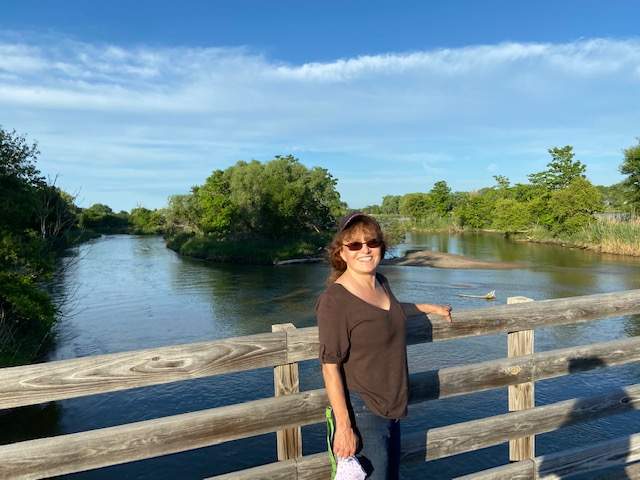](https://blogger.googleusercontent.com/img/b/R29vZ2xl/AVvXsEh6_2X9dbvyrvalOBKsWXK8q4rvlTwnfjV2xvselVCEooKq497Po3iHFPo9BtpE8y3JZbvRftSUmPtviYR8n2d-mU2ZVzSmfnZtYP2z934TNF6CTb8uIcLzGnSpEF8Xujwv7LrVCo0-wYXt/s640/susie-bridge.JPG)

And striking colors on the way!

[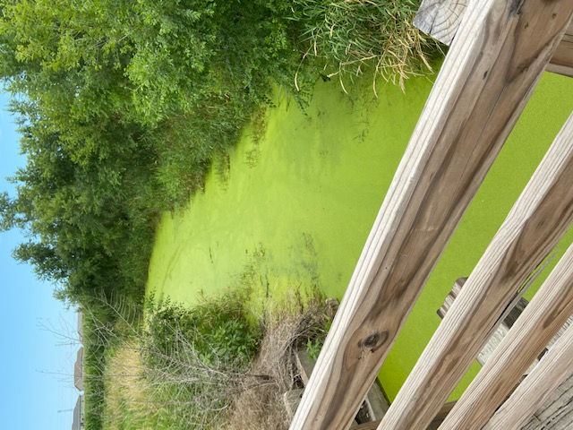](https://blogger.googleusercontent.com/img/b/R29vZ2xl/AVvXsEhzC6fZim68_bXBIZihv678W4TfrkYSKq_il6sSHzVPVVuZQKkhPd8OuB1lfxFxeBpvD7rnFJXFS1wYTUps4PM7zekmX4crObK3udBH1zmidvCcD4a1xh4SJwUmorSTOK_ASoBq6B9aeIIV/s640/green-bridge.JPG)

Outdoors is a great place to be. Don't you agree?

[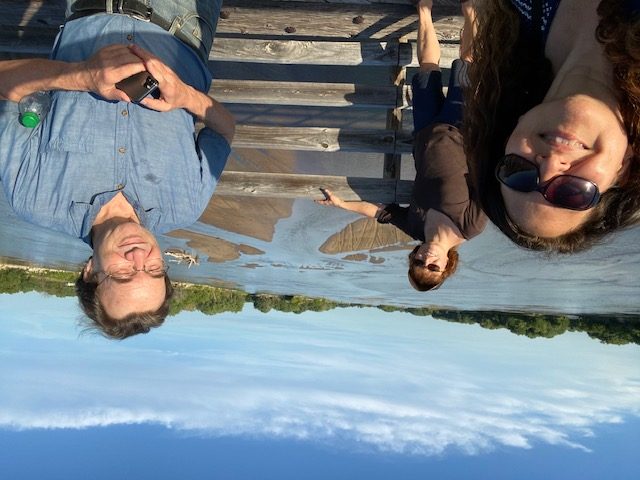](https://blogger.googleusercontent.com/img/b/R29vZ2xl/AVvXsEj7d45jgBfBq9p5DjKkpWe10YIC0YcP_eKSmlGUfmVhCE9BebeuIyEeXDv0aMBE68daHTaE4kCM4p0m2CrzpZgDeUxQJYFbWXsEGlxTbQfg5E-OhGkwED96cBh2S_NJFrUIppPraFQt3bBF/s640/patti-susie-jeff-bridge.JPG)
