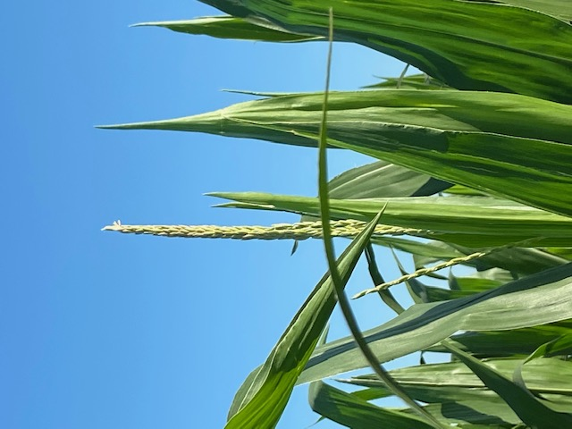
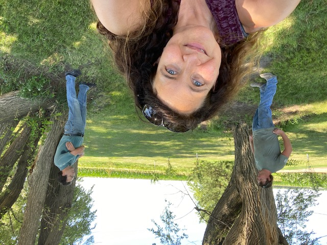
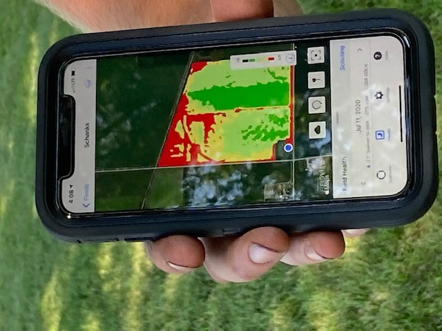
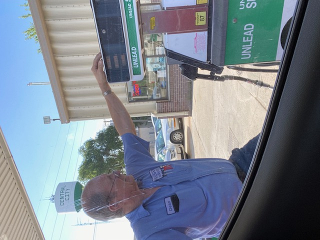
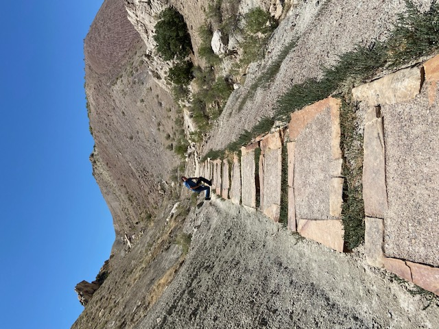
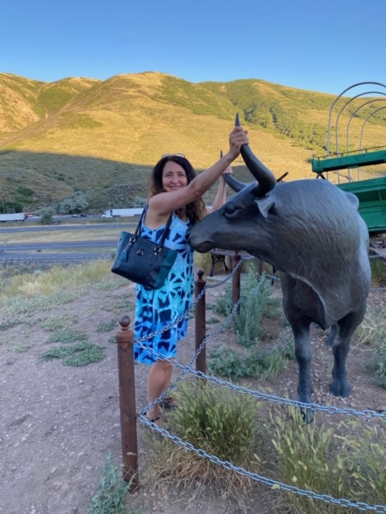
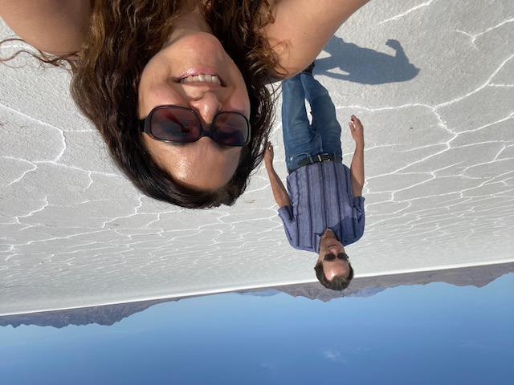

(Part 2 of [Drive out to the Farm](https://schankfarm.blogspot.com/2020/07/drive-to-farm.html))

A few days after we arrived in Nebraska, the silks started emerging from the small ears.

And tassels started appearing at the top of the stalks.

So it's pollination time! Aren't the silks just so pretty?

Want to learn how pollination works? See this brief [corn pollination video](https://ctlweb.sri.com/wisegenetics/prototype/cornPollination/cornPollination.html)that I helped make for work a few years ago.

Anyhow, we caught up with Keith later in the day...

And he showed us a digital map of the farm!

The red in the upper left is a problem area because the ground is lower there. More than 100 years ago when the train tracks were built (the diagonal line above the colors), they dragged the topsoil from that area to build up the area under the tracks! Before Dad got the farm in the '60s, that area was only used for pasture.

The groundwater is so high in our area that this section stays wet longer. To fix it, we'd need to add 6-12 inches of topsoil back. But that's just not practical. Keith says he can still grow crops there and make it work. It just isn't the best spot on the farm.

It's always great to catch up with Keith and learn more about farming and the science around it.

A few days later, we waved goodbye to farm and the house, for now.

We filled up with gas at the full-service station where they (still!) have someone fill your tank for you.

And we drove west, stopping at Dinosaur National Monument along the way.

And grabbed the bulls by the horns!

And smelled the roses.... er, thistles.

And strolled out on the Bonneville Salt Flats - which were amazing!

This was the first time I've driven back to Nebraska since I drove west more than three decades ago. It was way more fun than I imagined.

Thank you, Jeff, for being a most wonderful travel companion and mostest wonderful brother!
😘
