(Written while listening to [Supertramp](https://www.youtube.com/watch?v=7btmeE8Ewa8))

I looked over at my Romeo. How about we make a picture show? Let's take the long way home. A corona-free drive home.

We'll have some times when we feel we're part of the [scenery](https://www.nps.gov/zion/planyourvisit/kolob-canyons.htm).

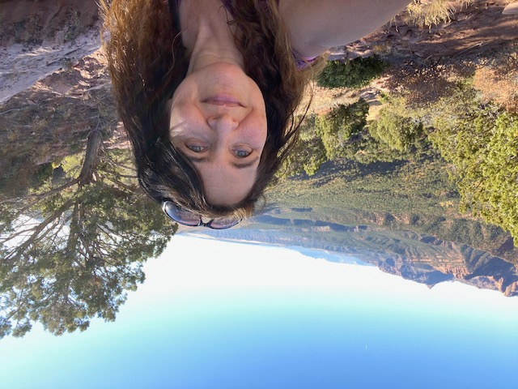

All the greenery! Hike up and down, boy?

[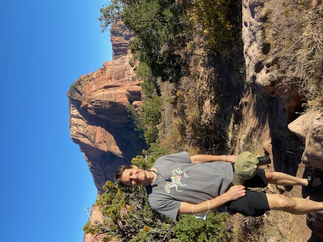](man-red-rocks.jpg)

When you see the [arches](https://www.nps.gov/arch/index.htm), it's so unbelievable.

[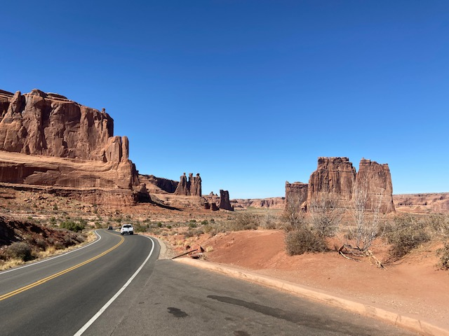](scenic-desert-road.jpg)

Unforgettable. How we adored you...tah.

[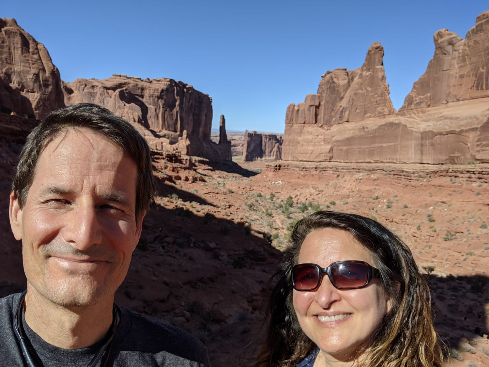](0bc23c92-6000-4872-a971-29e08bffa478.JPG)

Past two days and two airbnb nights,

[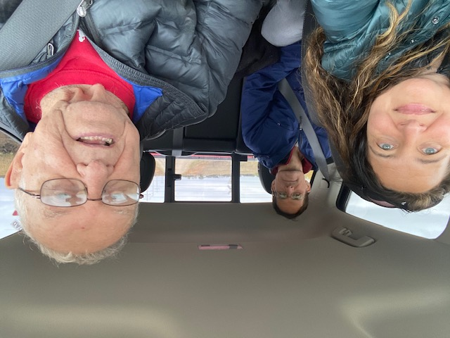](car-trip-selfie.jpg)

We took a trip to see the farm house lights. And porches newly stained; wood now darkly grained.

[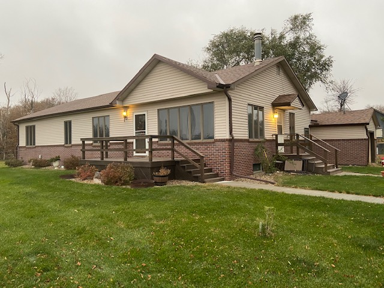](suburban-house-deck.jpg)

Then to the barn, to give scraps to Dad's favorite hens,

[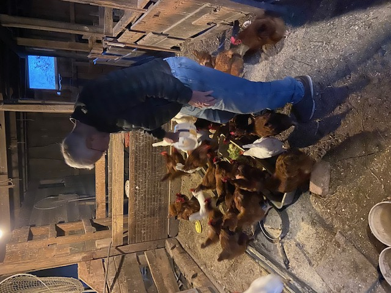](feeding-chickens-coop.jpg)

and grass to our cute cow friends. To tell 'em "We adore you."

[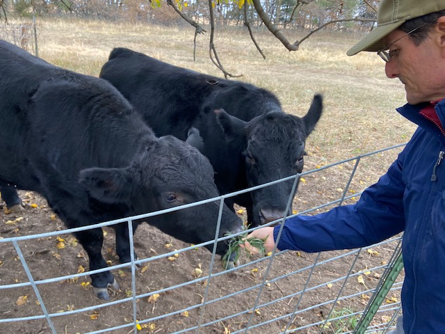](man-feeding-cows.jpg)

When they think hair is delicious hay,

[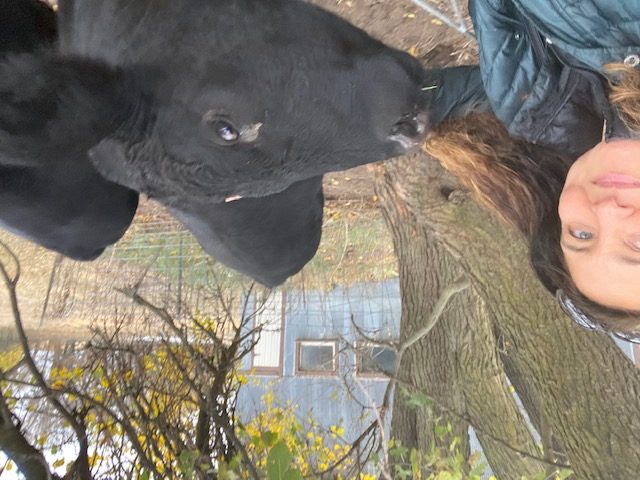](woman-cow-selfie.jpg)

That's quite peculiar, you say. But also cute, so we'll be nice!

[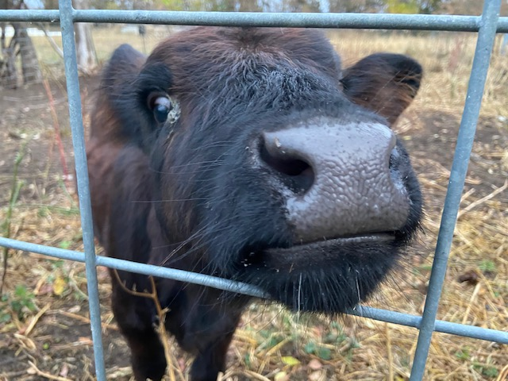](baby-cow-fence.jpg)

And when the day comes to settle down, careful siblings gather 'round.

[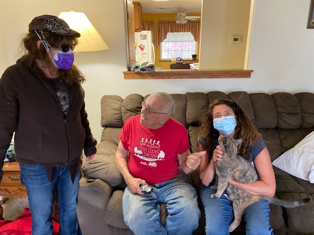](family-living-room.jpg)

And put streamers all around. (That Sophie so wants to tear down!)

[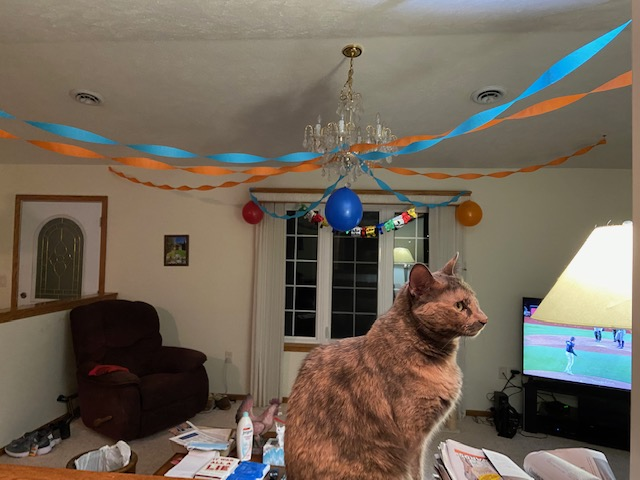](birthday-cat-decorations.jpg)

Happy 97th birthday, you say! A very [special day](https://theindependent.com/announcements/birthdays/charles-schank/article_1705ea6a-0fe2-11eb-8d9d-0b834820da29.html). Friends' cards say, "We adore you!"

[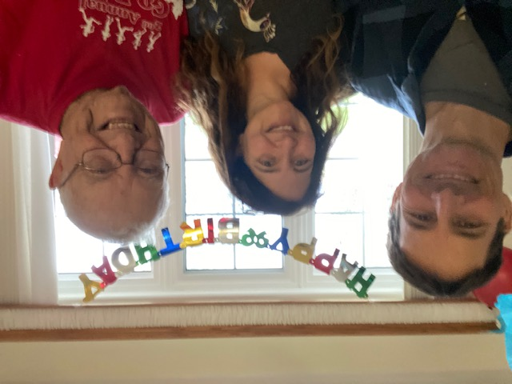](birthday-family-selfie.jpg)

Next day, we check out the corn and learn,

[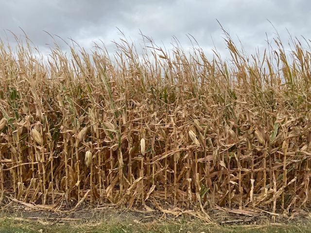](dry-corn-field.jpg)

just what the yield has earned. 242 bushels/acre - sure is nice!

[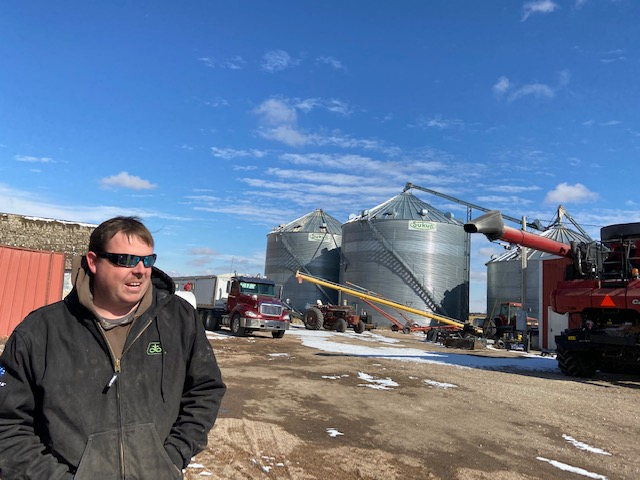](farmer-grain-silos.jpg)

Then Keith gives Dad some model toys; tiny equipment for the birthday boy,

[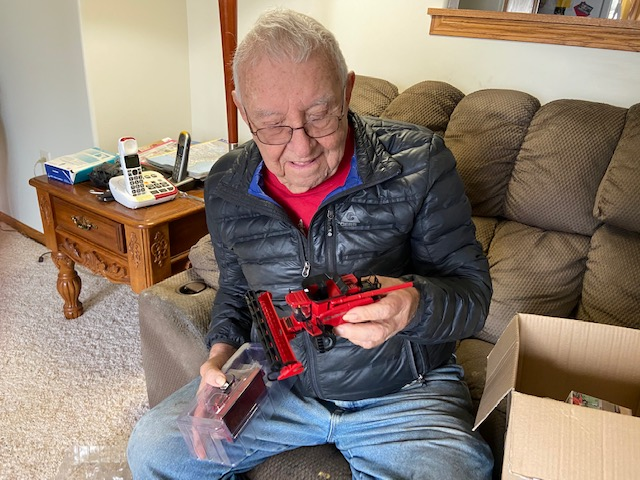](man-toy-combine.jpg)

Tractor, trailer, and combine,

[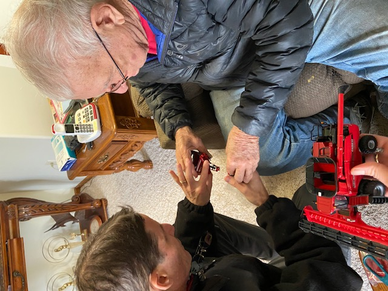](playing-toy-tractors.jpg)

And oh, they look so fine!

[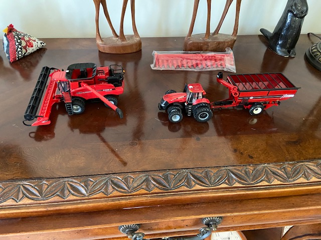](toy-farm-equipment.jpg)

Next day we go for another drive,

[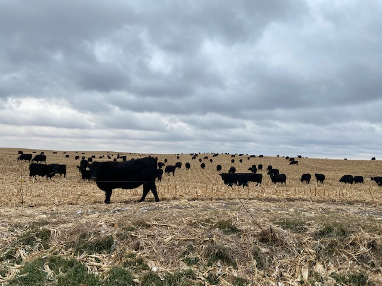](cattle-harvested-field.jpg)

And learn about Nebraska [solar](http://www.mesnerdevelopment.com/mesner-solar-development/) over a distance fire.

[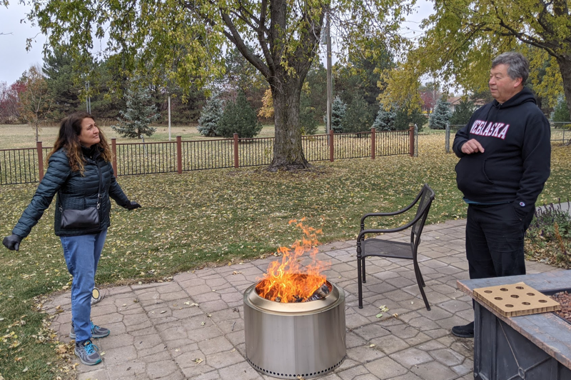](fire-cliff.png)

Before we take the long way home.

[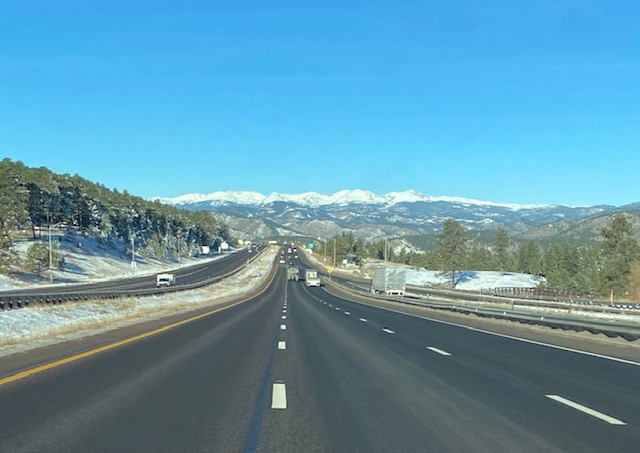](highway-snow-mountains.jpg)

The I-70 long way home.

[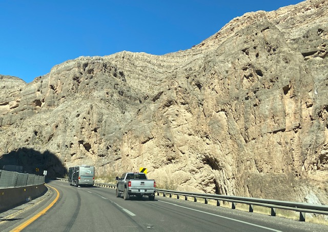](canyon-highway-drive.jpg)

Back in Utah, we see a peculiar valley,

[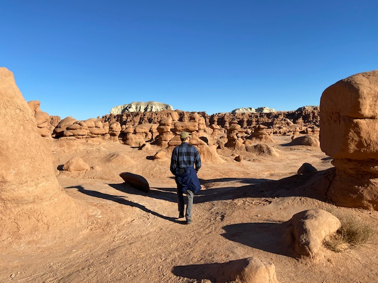](goblin-valley-hike.jpg)

with a strange and colorful gallery,

[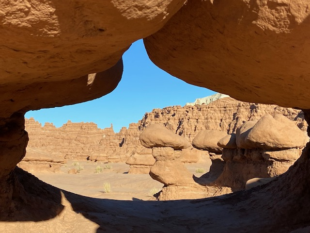](goblin-valley-hoodoos.jpg)

of sandstone [goblins](https://stateparks.utah.gov/parks/goblin-valley/), whoa!

We wonder if we could be losing our sanity. Is it volcanity?

[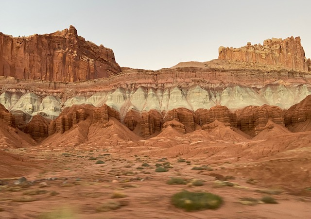](layered-canyon-cliffs.jpg)

No, it's a [geologic monocline](https://www.nps.gov/care/index.htm)!

You never see all you wanna see, or everything ya coulda seen. If we only had more time.

[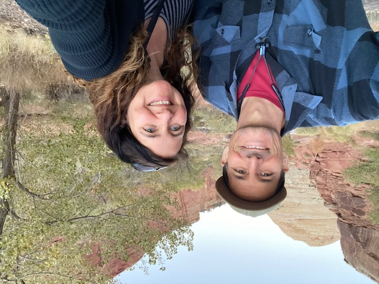](couple-canyon-selfie.jpg)

But a dash light's on, and it's a warning sign. Is the car still fine? Head for the Arizona line!

[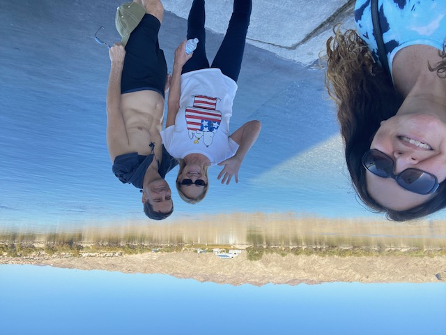](beach-family-selfie.jpg)

We gather rocks along a river road, and in the trunk, they nicely stowed.

[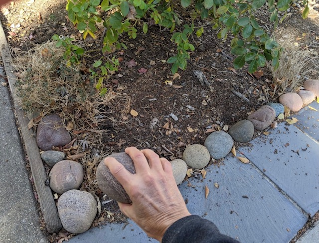](placing-garden-stone.jpg)

To decorate our own fine home. A lovely long way home!

[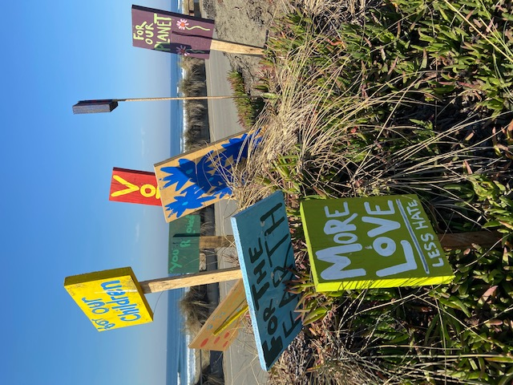](painted-beach-signs.jpg)
