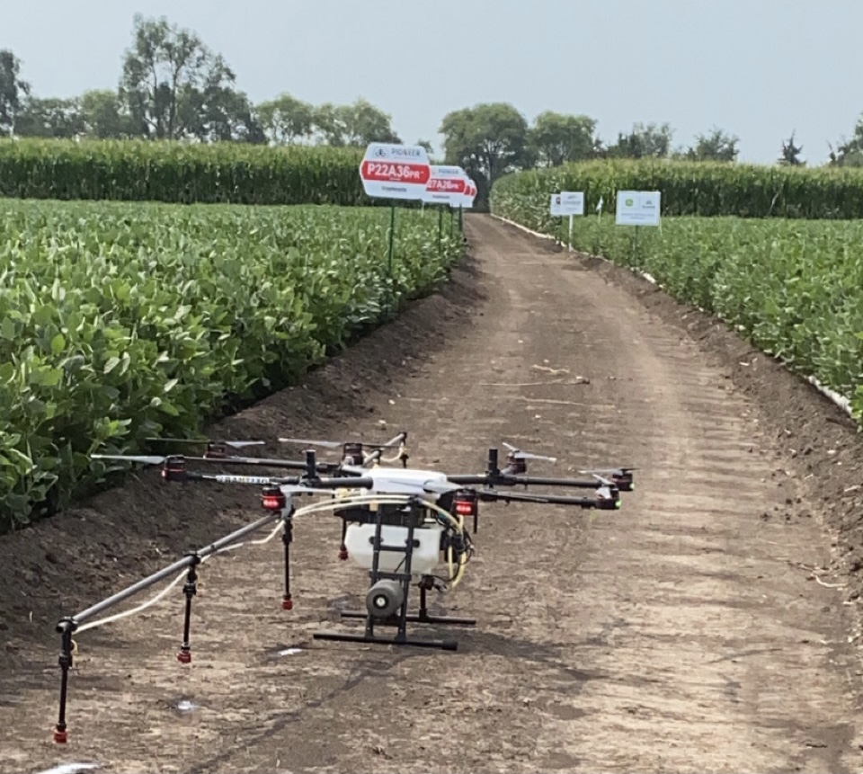

Keith shared some cool videos with us a couple of days ago while he was "applying fungicide, insecticide, molasses, and a foliar fertilizer" to the soybeans.

Molasses? Yes, "it helps feed the microbes in the soil and helps with photosynthesis," Keith says. "I've probably ran close to 3 gal. an acre of sugar and molasses products on those. But that molasses also contains a little fertilizer in it."

I text back that he's moving along at a good clip! "Somewhere between 16 and 17 mph," he says. "My nozzles were just a little too big for the rate I wanted to run. I cover a 120ft swath with that machine. At the rate of speed I was traveling, if I didn't have to turn or fill, I would cover 230 acres an hour or at least that's what the monitor said."

(For a little comic relief, I text some photos of the tomatoes and cucumbers in our back yard. Keith kindly replies that nothing beats fresh vegetables :)

"This is something else cool I got to watch the other day on a research plot. I think this is the future of agriculture. It was doing basically the same thing I was doing."

With a tractor, he can carry a HUGE amount of fertilizer, though... how much liquid can a drone like that could carry? Sure would come in for lots of refills. Maybe the farmer would help with the refills, and have fun overseeing, remote flying, and/or watching? Or... go out for lunch?

Regardless, seems better than aerial application by a crop duster plane (more precise, less  unintentional coverage beyond your field) -- and easier than driving through crops if they get too tall!
