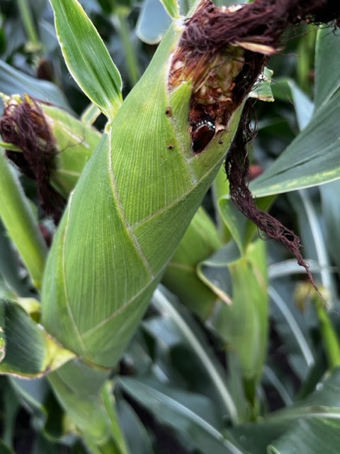
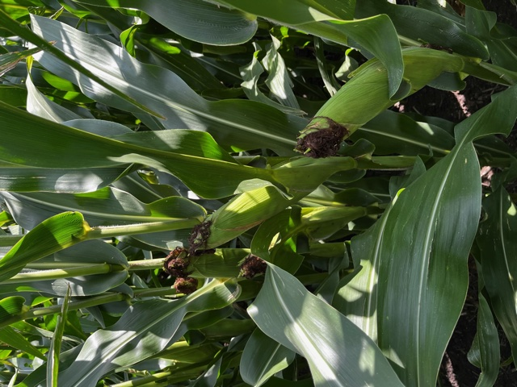
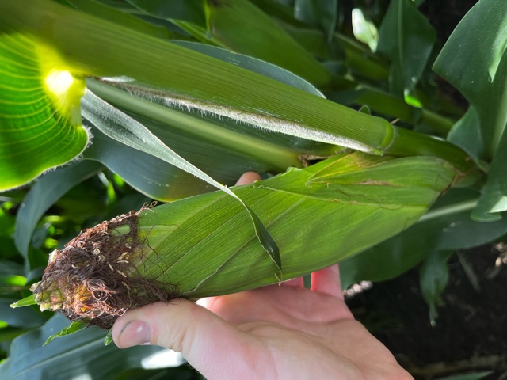

Keith wrote that it's been really hot and dry, and they've had almost no breaks from irrigation, but the crops that have been getting water look pretty good. Luckily we have a very high water table under our farm.

They're having problems with a [Japanese beetle](https://cropwatch.unl.edu/2019/japanese-beetles) this summer, though, and haven’t had super great luck stopping them.  His girlfriend had the beetles in her rose bushes, and a mix of water and Dawn dish soap killed them. Keith says he uses a lot of Dawn for farm related stuff. "It acts like mixing agent that keeps all the chemicals together when spraying and some weeds it helps break down the waxy coating on the outside of the plant helping herbicides penetrate the weeds. The rate I read was actually an ounce per 100gal of total mixture. It’s pretty interesting that it works as good as it does."

Courtney also mentioned the beetles the other day during a phone call; she said they invaded all the trees around the place. (Omg, Dad would have had a cow.) She said that they leave grubs in the lawn, and to control them, you have to kill them at particular times. The [almanac](https://www.almanac.com/pest/japanese-beetles) says: "In the grub stage of late spring and fall (beetles have two life cycles per season), spray the lawn with 2 tablespoons of liquid dishwashing soap diluted in 1 gallon of water per 1,000 square feet. The grubs will surface and the birds will love you. Spray once each week until no more grubs surface." Who knew that dish soap was so useful?

I mentioned that I read that the [Asian jumping worm](https://neinvasives.com/species/insects/asian-jumping-worm) is making its way into Nebraska. He hasn't seen those around, yet. "I sure hope we can avoid the worms, it’s starting to feel like every year there is a new insect or weed that’s hard to control. I hope our minimum tillage helps prevent the spread of the worms."

Japanese beetle in the corn:

And a few photos from mid August:

