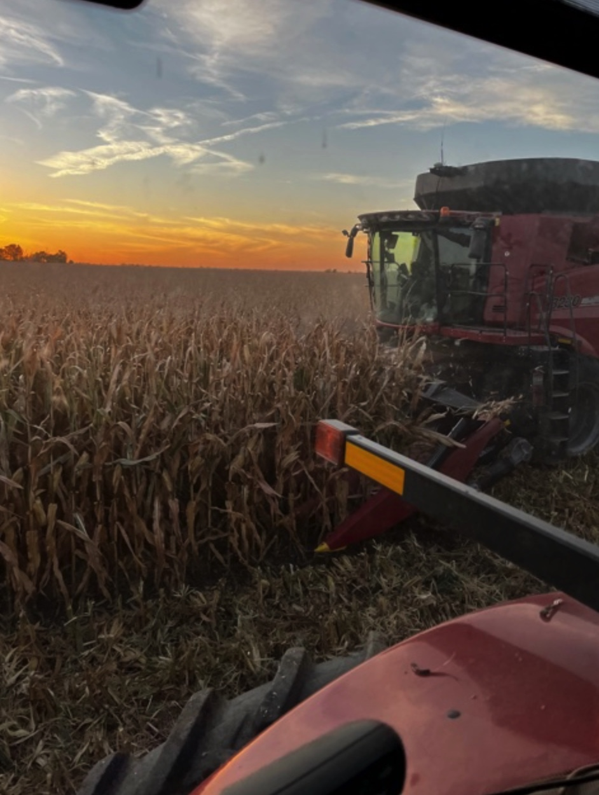
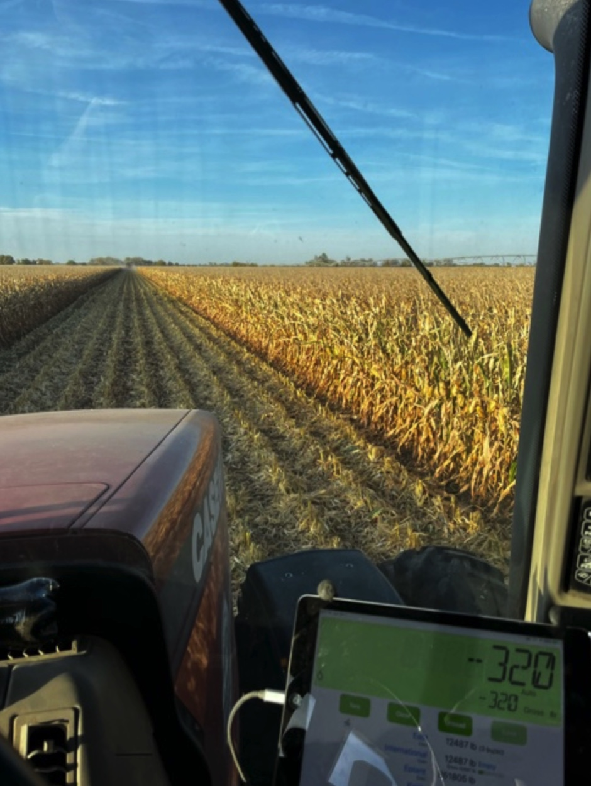
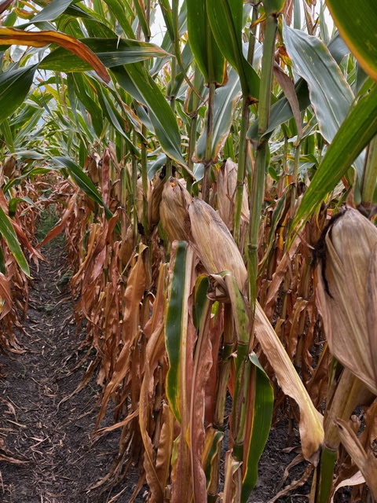
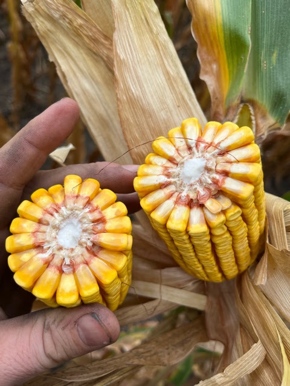

Keith says, "I thought I’d share that we started picking on your farm late yesterday afternoon. It seems like really good corn so far! It is also coming out really dry, I think one load I hauled in today was 14.8% moisture. I haven’t gotten to take many pictures of the harvest but I managed to get 2 last night so I will include them.  First picture is our very first pass though the field second picture I just thought the sunset looked neat with the combine." (The photos are actually reversed below, because sunset!)

How nice would it be to have this sunset be your view from work?

Below is how the corn looked around September 26, when Keith started harvest on some dryland beans. When he pulled some ears out of our field around September 21, the moisture was 23.4%. The leaves were "unbelievably green" for that kind of moisture. That's at a level where they could store and dry it, or wait a week or two when it hits 18% and it can go right to town.

I asked if he took our corn straight to town or stored it. Keith said, "There was a premium to get corn delivered to the ethanol plant early on so we’ve been just doing that. We haven’t started filling our contracts yet. Depending on yields we usually have to haul in between 100-150k bushels. We have about 220k bushels of storage at my place. We also have some smaller bins that we don’t use much anymore where I grew up."

In a typical harvest, our 170 acre farm yields at least 40,000 bushels, which is a bit more than a 1000 metric tons of corn (kernels). That's about 40 semi-trailer loads. So if Keith and his dad store+haul in 220k-270k bushels across all of the fields they farm, they are farming 6-7 fields like ours. That means that the two of them are picking, filling, and hauling like 250 semi-trailer loads to town or to their storage. I can see how that keeps them busy!

The "unbelievably green" field around September 26, at 23.4% moisture:

